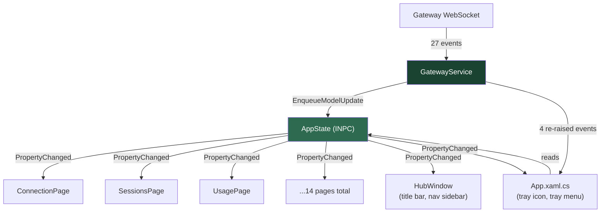
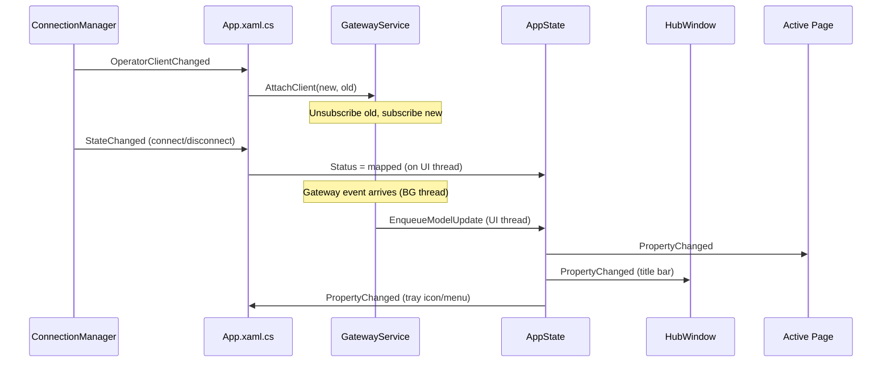

# Data Flow Architecture

This document describes how gateway data flows from the WebSocket connection to the UI — the observable application model, event handling, and page update patterns.

## Overview

The tray app uses a single observable model (`AppState`) as the source of truth for all gateway-cached state. A dedicated event handler service (`GatewayService`) owns all 27 WebSocket event subscriptions and dispatches updates to `AppState` on the UI thread. Pages subscribe to `AppState.PropertyChanged` for live updates.



## Key components

### AppState (`Services/AppState.cs`)

Single source of truth for all gateway-cached data. Implements `INotifyPropertyChanged`.

```
src/OpenClaw.Tray.WinUI/Services/AppState.cs
```

**Properties** (24+): `Status`, `CurrentActivity`, `Sessions`, `Channels`, `Nodes`, `Usage`, `UsageCost`, `UsageStatus`, `GatewaySelf`, `NodePairList`, `DevicePairList`, `ModelsList`, `Presence`, `AgentsList`, `Config`, `ConfigSchema`, `SkillsData`, `CronList`, `CronStatus`, `CronRuns`, `AgentFilesList`, `AgentFileContent`, `AuthFailureMessage`, `UpdateInfo`, `LastCheckTime`

**Threading model**: All property writes must happen on the UI thread (enforced by `Debug.Assert` in `SetField`). This guarantees `PropertyChanged` fires on the UI thread, so pages can update UI directly without `DispatcherQueue.TryEnqueue`.

**Lifetime**: Created once in `App.OnLaunched`, lives for the app's lifetime. Accessible globally via `((App)Application.Current).AppState`. Connections come and go; pages always have a single stable view of the data.

**Key methods**:
- `ClearCachedData()` — resets all gateway data fields on disconnect (does NOT reset `Status` — that's managed by `OnManagerStateChanged`)
- `AddAgentEvent(evt)` — ring buffer, newest-first, capped at 400
- `GetAgentIds()` — computed from `AgentsList` JSON
- `SetSessionPreview/GetSessionPreview/PruneSessionPreviews` — thread-safe via lock

### GatewayService (`Services/GatewayService.cs`)

Owns all 27 operator gateway client event subscriptions. Moved from App.xaml.cs to separate concerns.

```
src/OpenClaw.Tray.WinUI/Services/GatewayService.cs
```

**Event categories**:

| Category | Count | Pattern | Examples |
|----------|-------|---------|----------|
| A: Simple data | 15 | `EnqueueModelUpdate(() => _state.X = value)` | Usage, Config, Models, Presence |
| B: Complex data | 8 | Update AppState + side effects (logging, dedup, throttling) | Channels, Sessions, Nodes, Activity |
| C: Re-raised | 4 | Update AppState + re-raise event for App | StatusChanged, AuthFailed, SessionCommand, Notification |

**Stale-event safety**: Uses a generation counter (`_clientGeneration`) that increments on every `AttachClient` call. The `EnqueueModelUpdate` helper captures the generation and re-checks inside the dispatcher callback, preventing stale events from an old client from mutating state after a client swap.

```csharp
private void EnqueueModelUpdate(Action update)
{
    var gen = _clientGeneration;
    _dispatcher.TryEnqueue(() =>
    {
        if (gen == _clientGeneration) update();
    });
}
```

**Client lifecycle**: `AttachClient(newClient, oldClient)` unsubscribes from old, increments generation, clears service-level caches (channel signature, session activities, display state), subscribes to new.

### App.xaml.cs — orchestration layer

App creates `AppState` and `GatewayService` in `OnLaunched` and wires them together:



**What stays in App**:
- `OnManagerStateChanged` — maps `GatewayConnectionSnapshot` to `ConnectionStatus`, writes `AppState.Status`
- Node service handlers — `OnNodeStatusChanged`, `OnPairingStatusChanged`, etc.
- Toast/notification display (via `ToastService`)
- Window management — `ShowHub`, `ShowChatWindow`, `ShowVoiceOverlay`
- Tray icon/menu updates (subscribes to `AppState.PropertyChanged`)
- `IAppCommands` implementation

**What moved out**:
- 27 gateway event handlers → `GatewayService`
- 20+ `_last*` cached fields → `AppState` properties
- Toast dedup state → `ToastService`
- Diagnostic clipboard methods → `DiagnosticsClipboardService`

### Pages — direct observation

Pages access `AppState` globally and subscribe to `PropertyChanged` for live updates. They no longer depend on `HubWindow` for data.

```
// Every page that observes gateway data:
private static App CurrentApp => (App)Application.Current;
private AppState? _appState;

public void Initialize()
{
    _appState = CurrentApp.AppState;
    _appState.PropertyChanged += OnAppStateChanged;
}

private void OnAppStateChanged(object? sender, PropertyChangedEventArgs e)
{
    switch (e.PropertyName)
    {
        case nameof(AppState.Sessions):
            // UI update — already on UI thread
            break;
    }
}
```

**Page observation map**:

| Page | Observes |
|------|----------|
| ConnectionPage | Status, NodePairList, DevicePairList, Channels, UsageCost, Sessions, GatewaySelf |
| SessionsPage | Sessions, ModelsList |
| ChannelsPage | Channels |
| UsagePage | Usage, UsageCost, UsageStatus |
| InstancesPage | Nodes, Presence |
| ConfigPage | Config, ConfigSchema |
| BindingsPage | Config |
| CronPage | CronList, CronStatus, CronRuns |
| SkillsPage | SkillsData |
| WorkspacePage | AgentFilesList, AgentFileContent |
| AgentEventsPage | AgentEventAdded (separate event) |
| AboutPage | GatewaySelf |

Pages that don't observe AppState: ActivityPage, ChatPage, SettingsPage, SandboxPage, VoiceSettingsPage.

### HubWindow — minimal role

HubWindow's role is now limited to:
- **Title bar** — subscribes to `AppState.Status` and `AppState.GatewaySelf` for status/version display
- **Navigation sidebar** — subscribes to `AppState.AgentsList` to rebuild agent nav items
- **Page lifecycle** — `InitializeCurrentPage()` calls `page.Initialize()` when the user navigates

HubWindow no longer caches gateway data or forwards updates to pages.

## Service file map

```
src/OpenClaw.Tray.WinUI/Services/
├── AppState.cs                    — Observable model (INPC, 24+ properties)
├── GatewayService.cs              — 27 event subscriptions, UI dispatch
├── IAppCommands.cs                — Page → App command interface
├── ToastService.cs                — Toast display, dedup, sound config
├── DiagnosticsClipboardService.cs — Copy* diagnostic clipboard methods
├── AppStateSnapshot.cs            — Frozen snapshot for CommandCenter
├── TrayStateSnapshot.cs           — Frozen snapshot for tray tooltip
├── TrayMenuSnapshot.cs            — Frozen snapshot for tray menu builder
├── TrayMenuStateBuilder.cs        — Builds tray popup menu UI
└── TrayTooltipBuilder.cs          — Builds tray tooltip string
```

## Threading rules

1. **AppState writes**: UI thread only. `SetField` asserts `DispatcherQueue.HasThreadAccess`.
2. **GatewayService handlers**: Run on WebSocket background threads. Use `EnqueueModelUpdate` to dispatch to UI thread before writing to AppState.
3. **PropertyChanged handlers**: Fire on UI thread (guaranteed by rule 1). Pages can update UI directly — no `TryEnqueue` needed.
4. **Session previews**: Thread-safe via `lock` (read from any thread, write from any thread).
5. **Tray menu refresh**: Debounced via `DispatcherQueuePriority.Low` to coalesce rapid AppState changes.
