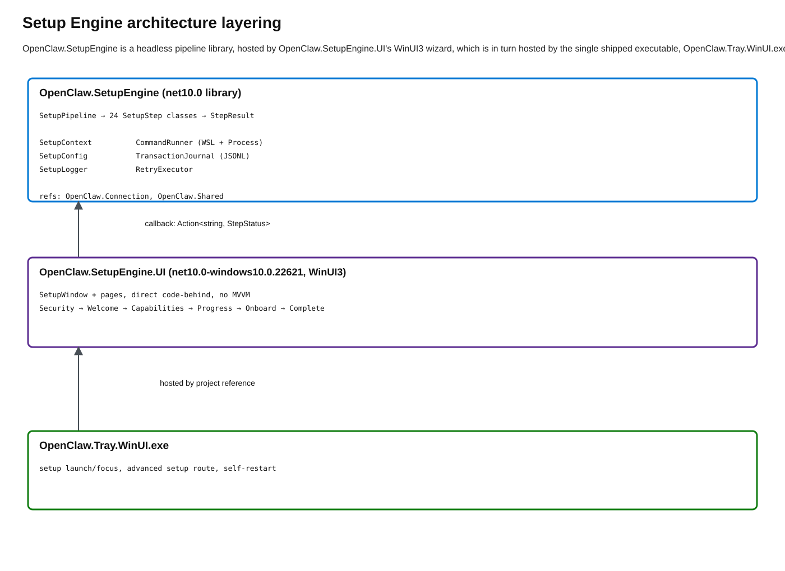

# Setup Engine - Architecture & Reference

## Overview

The Setup Engine is a **config-driven system** for provisioning an OpenClaw WSL gateway from scratch. It consists of two setup projects plus the tray host:

1. **`OpenClaw.SetupEngine`** - Headless pipeline library. Runs 24 steps sequentially with full JSONL logging, transaction journal, and rollback support.
2. **`OpenClaw.SetupEngine.UI`** - WinUI3 setup window/pages that wrap the same pipeline with a fluent wizard UI.
3. **`OpenClaw.Tray.WinUI`** - The only shipped WinUI executable. It hosts `SetupWindow` directly and self-restarts after successful setup.

The bundled `default-config.json` ships with the tray executable and provides secure defaults (loopback bind, WSL isolation, systemd enabled). Defaults can be overridden via config file or environment variables.

WSL wizard completion restores `gateway.reload.mode` before explicitly restarting
the Gateway. Gateway 2026.9.6 may refuse the guarded restart when it cannot verify
a live serving owner; the rejected owner-lease predicate is not exposed by the
public Gateway CLI. A reload-triggered supervisor transition is one possible
timing explanation, not an established cause of every refusal. Observed service
states differ: local diagnostics captured `activating/auto-restart` with no
MainPID, while hosted generic refusals captured an `active/running` unit and a
live PID. Neither snapshot establishes the admission-time owner-lease predicate.
`SetupWizardRunner` recognizes only the exact
serving-owner refusal, waits for verified managed endpoint ownership using the
existing bounded provenance probe, and retries the normal CLI restart once.
The probe allows up to 30 one-second retry delays, plus probe duration, for
`NoListener` and `UnknownListener` tagged `ListenerSnapshotChanged`. Other
unknown/conflicting listeners, other restart errors, and a repeated refusal still
fail setup. Listener provenance does not prove owner-lease or coordinator
readiness; the retried CLI command retains those guards. Restart-intent recording
contention is a separate failure and is not retried here. There is no direct
systemd restart fallback or ownership bypass.

The separate **native Gateway MSIX** Welcome path does not use
`SetupStepFactory.BuildDefaultSteps()`. `NativeGatewaySetupService` owns its
dedicated-profile and package preparation. `NativeGatewaySetupSession` owns
staged-record runtime authorization, reload suspension/restoration, retry/cancel,
authenticated health/config gates, and final registry publication.
`WizardPage` is the single hosted WinUI wizard for both WSL and native:
`wizard.start/next/cancel` transport, upstream prompts, and provider/model cards
are not duplicated. Native uses the upstream `installDaemon: false` contract.
`NativeGatewayPackageResolver`
checks Windows package registration and package-qualified aliases.
`NativeGatewayMsixInstaller` opens the
[OpenClaw Gateway Microsoft Store listing](https://apps.microsoft.com/detail/9nv70lv3d6xc?hl=en-US&gl=US)
when a package is not installed. Microsoft Store owns architecture selection,
installation consent and deployment; no local MSIX path is required.
`NativeGatewayPackageIdentity` pins the exact Store name/publisher pair and retains
the original development identity for existing installations. Multiple matching
registrations fail explicitly for new setup. Existing runtime profiles resolve only
their saved family, allowing both packages to coexist without an implicit migration.
`NativeGatewayPackageAcquisition` automatically opens it once only for missing
registration, then waits up to five minutes for verified package readiness.
Cancellation stops the wait, not Windows deployment. Repair errors and timeouts
stay visible, with explicit retry rather than repeated installer launches.
Native setup shares the capability profiles and Windows permissions page with
WSL but skips WSL/Local AI/Tailscale installation review and probes. The native
progress page uses shared spinner/checkmark rows and automatically enters the
Gateway wizard after preparing its runtime. Finalization applies the selected
Gateway command allowlist before config/health gates, then persists only the
Companion node/capability settings. Completion does not claim node pairing.
`NativeGatewaySetupHost` runs captured `clawctl setup`, config validation, and
health commands, plus an explicitly requested profile-scoped recovery terminal.
It never launches `openclaw onboard` or WSL.
`NativeGatewayRuntime` in the Connection project owns the gateway process.
This path is non-isolated and UI-only. Companion never downloads an MSIX itself
or bypasses Microsoft Store installation.
Existing headless setup arguments continue to select the WSL pipeline.
See [Native Gateway MSIX](ONBOARDING_WIZARD.md#native-gateway-msix-not-isolated)
for consent, lifecycle, retry, and acquisition boundaries.

See [Gateway setup responsibilities](GATEWAY_SETUP_RESPONSIBILITIES.md) for the
Gateway packaging responsibility matrix, its comparison with WSL provisioning,
and the decided Companion-owned MXC lifecycle. The required isolated path
preserves identity/configuration across restarts, stops on exit, and deprovisions
only on explicit removal. Its package activation and listener-provenance contracts
remain blocked pending integration proof; the non-isolated runtime is not a
substitute.

The [Welcome recommendation policy](ONBOARDING_WIZARD.md#welcome) now checks
`wxc-exec --probe` session capability before recommending the existing native
Gateway. `NativeGatewaySetupEligibility` owns admission and selection policy.
Unavailable capability offers Windows Update with the pinned SDK's Insider
baseline (26340.9212); failed probes offer retry/repair instead. WSL is always
visible as the second option after native, with existing-gateway connection third.
Explicit WSL and existing-gateway choices survive late native probe results. Welcome has no
manual recheck button; reopening the page checks again. The separate isolation warning/checkbox is removed by the
2026-09-18 product decision; general security consent remains. This is not
session provisioning. Gateway distribution includes x64, ARM64 and MSIX bundle
artifacts, but the temporary development installer remains ARM64-only.

> **Status note (2026-07-06):** Current default setup includes `WindowsNodeBootstrapContextStep`, which injects Windows-node context into the WSL workspace `AGENTS.md` after onboarding.

---

## Architecture



[Edit the setup-engine layering diagram](diagrams/setup-engine-layering.excalidraw).

---

## Project Structure

```
src/OpenClaw.SetupEngine/
├── OpenClaw.SetupEngine.csproj    # net10.0 library
├── Program.cs                     # callable entry: --config, --headless, --dry-run, --rollback-on-failure
├── SetupPipeline.cs               # Sequential step orchestrator (132 lines)
├── SetupContext.cs                # Config model + shared state bag (217 lines)
├── SetupSteps.cs                  # Shared setup-engine helpers (WslConstants, WslInstallSupport,
│                                   #   SetupOpenClawLogger, SetupPairingCredentialPolicy,
│                                   #   WindowsGatewayReachability); one file per step class lives
│                                   #   alongside it (e.g. CreateWslInstanceStep.cs,
│                                   #   ConfigureGatewayStep.cs, StartKeepaliveStep.cs, ...)
├── KeepaliveProcessManager.cs      # Setup-time WSL keepalive process/marker/rollback owner
├── TailscaleSetupSteps.cs         # The 4 Tailscale setup steps, grouped
├── TransactionJournal.cs          # Append-only JSONL journal (77 lines)
├── SetupLogger.cs                 # Structured JSONL logger (112 lines)
├── CommandRunner.cs               # Concrete WSL/process command runner
├── RetryExecutor.cs               # Exponential backoff retry
├── StubNodeCapability.cs          # Minimal capability stubs for pairing
└── default-config.json            # THE source of truth for all config values

src/OpenClaw.SetupEngine.UI/
├── OpenClaw.SetupEngine.UI.csproj # WinAppSDK library referenced by tray
├── SetupWindow.xaml / .xaml.cs    # 720×820 window, Mica, title bar, navigation, setup events
└── Pages/
    ├── SecurityNoticePage.xaml / .cs # Device-trust warning
    ├── WelcomePage.xaml / .cs        # Install WSL gateway vs connect existing
    ├── CapabilitiesPage.xaml / .cs   # Profile, inline permissions, install review
    ├── ProgressPage.xaml / .cs       # Live step rows + gateway-installed handoff
    ├── WizardPage.xaml / .cs         # OpenClaw onboard transcript
    └── CompletePage.xaml / .cs       # Mascot status badge, summary, startup toggle
```

The pipeline runs 24 steps (see `SetupStepFactory.BuildDefaultSteps()` in `SetupPipeline.cs` for
the authoritative order. This doc's step table below predates the 4 Tailscale steps and is not
fully current). UI adds ~10 more files.

---

## Config File (`default-config.json`)

**Config is required.** Neither the headless exe nor the UI will run without one. The bundled `default-config.json` is auto-loaded from `AppContext.BaseDirectory` if no `--config` is specified.
If the setup UI cannot find, read, or deserialize the selected configuration,
it opens on the setup failure page with the load error and does not start setup.

New WSL distros use a 1-64 character name containing ASCII letters, digits,
periods, underscores, or hyphens, beginning and ending with a letter or digit.
Uninstall also accepts older names with spaces or Unicode when the name is one
safe Windows path segment and resolves to an immediate child of the app-owned
`LocalDataDir\wsl` root. Teardown rejects filesystem aliases, case or Unicode
normalization collisions, and reparse points at either the root or managed
child. It also preserves the VHD directory unless WSL confirms the distro is
absent or unregister succeeds. To replace such a legacy distro, uninstall it
first, using `--uninstall --confirm-destructive` and the same distro name, then
rerun setup with a supported new name.

```json
{
  "DistroName": "OpenClawGateway",
  "GatewayPort": 18789,
  "BaseDistro": "Ubuntu-24.04",
  "Headless": true,
  "AutoApprovePairing": true,
  "CleanBeforeRun": true,
  "SkipPermissions": false,
  "SkipWizard": false,
  "WizardAnswers": {
    "openclaw-setup": "true",
    "security-disclaimer": "true",
    "i-understand-this-is-personal-by-default-and-shared-multi-user-use-requires-lock-down-continue": "true",
    "setup-mode": "quickstart",
    "existing-config-detected": "true",
    "config-handling": "keep",
    "quickstart": "true",
    "model-auth-provider": "skip",
    "default-model": "__keep__",
    "select-channel-quickstart": "__skip__",
    "search-provider": "__skip__",
    "configure-skills-now-recommended": "false"
  },
  "LogLevel": "trace",
  "LogPath": null,
  "GatewayUrl": null,
  "BootstrapToken": null,
  "RollbackOnFailure": false,

  "Wsl": {
    "User": "openclaw",
    "Systemd": true,
    "Interop": false,
    "AppendWindowsPath": false,
    "Automount": false,
    "MountFsTab": false,
    "UseWindowsTimezone": true,
    "Memory": null,
    "Swap": null
  },

  "Gateway": {
    "Bind": "loopback",
    "InstallUrl": null,
    "Version": null,
    "FallbackVersion": null,
    "HealthTimeoutSeconds": 90,
    "ReloadMode": "hot",
    "AuthMode": "token",
    "ExtraConfig": null
  },

  "Capabilities": {
    "System": true, "Canvas": true, "Screen": true,
    "Camera": true, "Location": true, "Browser": true,
    "Device": true, "Tts": true, "Stt": true
  },

  "Settings": {
    "EnableNodeMode": true,
    "AutoStart": false,
    "NodeSystemRunEnabled": true,
    "NodeCanvasEnabled": true,
    "NodeScreenEnabled": true,
    "NodeCameraEnabled": true,
    "NodeLocationEnabled": true,
    "NodeBrowserProxyEnabled": true,
    "NodeTtsEnabled": true,
    "NodeSttEnabled": true
  },

  "Pairing": {
    "TimeoutSeconds": 60
  }
}
```

### Config Layering (priority, highest wins)

1. CLI flags (`--headless`, `--log-path`, `--rollback-on-failure`, `--no-rollback-on-failure`)
2. Config file (explicit `--config` or bundled `default-config.json`)
3. Environment variables (`OPENCLAW_SETUP_DISTRO_NAME`, etc.)

---

## Pipeline Steps (24 total)

> Note: this table predates the 4 Tailscale setup steps; the current pipeline runs 24 steps
> total. See `SetupStepFactory.BuildDefaultSteps()` in `SetupPipeline.cs` for the authoritative,
> current order. Fixing this table fully is out of scope for the E0 file-split PR.

Executed sequentially. Each step is a small class (30–120 lines) in its own file under
`src/OpenClaw.SetupEngine/` (e.g. `PreflightOsStep.cs`).

| # | Step Class | What It Does |
|---|-----------|-------------|
| 1 | `ValidateDistroInstallPathStep` | Validate the configured WSL install path before destructive setup |
| 2 | `PreflightOsStep` | Validate Windows 64-bit, version ≥ 22H2 |
| 3 | `PreflightWslStep` | Verify WSL is installed and supports direct named clean installs |
| 4 | `PreflightWindowsTailscaleStep` | Validate optional Windows Tailscale prerequisites |
| 5 | `CleanupStaleDistroStep` | Unregister a leftover WSL distro only when durable app ownership and the live current-user registration base path agree, and remove an orphaned VHD directory automatically only with a path-bound marker; explicit destructive confirmation may override |
| 6 | `CleanupStaleGatewayStep` | Stop orphaned gateway service, remove config |
| 7 | `PreflightPortStep` | Check gateway port is available |
| 8 | `CreateWslInstanceStep` | Directly install a fresh app-owned WSL distro; never export a user's Ubuntu distro |
| 9 | `ConfigureWslInstanceStep` | Write wsl.conf, create user, set dirs |
| 10 | `ValidateWslLockdownStep` | Verify WSL isolation settings are applied |
| 11 | `InstallCliStep` | Run install script inside WSL |
| 12 | `InstallTailscaleStep` | Install optional Tailscale support inside the managed WSL instance |
| 13 | `AuthorizeTailscaleStep` | Authorize the configured Tailscale identity and trust mode |
| 14 | `ConfigureGatewayStep` | Write gateway config (bind, port, auth) |
| 15 | `InstallGatewayServiceStep` | `openclaw gateway install --force` |
| 16 | `StartGatewayStep` | Start service, poll health endpoint (90s timeout) |
| 17 | `FinalizeTailscaleServeStep` | Apply the final Tailscale Serve endpoint after gateway startup |
| 18 | `MintBootstrapTokenStep` | Generate bootstrap token via CLI |
| 19 | `PairOperatorStep` | WebSocket operator connection + device approval |
| 20 | `PairNodeStep` | WebSocket node connection + capability registration |
| 21 | `VerifyEndToEndStep` | End-to-end health check (operator → node round trip) |
| 22 | `RunGatewayWizardStep` | Run/configure the gateway wizard unless skipped |
| 23 | `WindowsNodeBootstrapContextStep` | Inject Windows-node context into the WSL workspace `AGENTS.md` |
| 24 | `StartKeepaliveStep` | Background WSL keepalive to prevent VM shutdown |

The Windows port preflight requires a free port before installation. Installing
the gateway service can start it immediately, so the subsequent WSL port check
accepts listeners only when every reported owner PID matches the installed
`openclaw-gateway.service` systemd `MainPID` in the configured distro. A process
name such as `node` or `openclaw` alone is insufficient. Conflicts retain the
port-in-use error and include owning process names when available. Missing
listener ownership or a failed listener inspection does not bypass the check.

### Local AI GPU admission

Local AI uses the CUDA driver's `cuMemGetInfo` total and free memory directly
for model qualification. DXGI and NVML dedicated-memory figures are not admission
caps: on the 48 GB RTX Spark SKU they can describe only the 16 GB carveout,
incorrectly excluding a supported unified-memory device. No separate shared or
host-memory estimate is added to the CUDA readings. Missing CUDA facts remain
retryable rather than becoming a definitive no-GPU verdict.

This qualification is not a guarantee of successful inference. Default setup
does not run inference to validate the selected model; the explicit inference
proof and recovery pipelines still do. Runtime failures remain runtime errors.

### Local AI Hugging Face cache rollout

Normal Local AI model acquisition writes verified GGUF files to the standard
Hugging Face hub cache selected by `HF_HUB_CACHE`,
`HUGGINGFACE_HUB_CACHE`, or the platform default. The installer reuses a
snapshot or content-addressed blob only through
`HuggingFaceHubCache.TryOpenVerifiedCacheFileAsync`, and cross-volume
materialization copies from that same verified open handle. A configured cache
root equal to or below the app-owned `LocalAI` directory is rejected before
mutation because uninstall removes that managed tree recursively.

Manifest schema 3 remains the compatibility format for existing app-owned
model paths. Passive manifest loads, status refresh, recovery inspection, and
uninstall reads do not migrate it. Setup reconciliation is the explicit
promotion gate: it verifies and copies the legacy model, atomically records a
schema-4 cache receipt, then selects the verified snapshot path as active.
Fresh installs write schema 4 directly while retaining the legacy relative
`ModelPath` and a verified app-owned compatibility copy for recovery and for
rollback to schema-4-aware transitional builds containing #1388
(feat(local-ai): add verified legacy model cache migration). Schema-3-only
releases do not understand a schema-4 `state.json`; the retained model bytes
alone do not make a direct downgrade to those releases compatible. Rollback
may remove a compatibility copy created by the current transaction, but it
never removes the verified shared-cache source.

Non-destructive Local AI recovery keeps the exact pre-recovery receipt as its
rollback baseline. A successful repair always writes schema 4 with the verified
hub-cache snapshot as the active model path, while preserving the legacy
compatibility path and the prior gateway fallback, install time, and rollback
metadata.

Completed cache files and pre-existing resumable partials are shared state.
Setup rollback and uninstall do not delete them. Unsafe links, reparse points,
hard-linked partials, destination conflicts, receipt mismatches, and concurrent
manifest changes fail closed.

### Step Base Class

```csharp
public abstract class SetupStep
{
    public abstract string Id { get; }
    public abstract string DisplayName { get; }
    public abstract Task<StepResult> ExecuteAsync(SetupContext ctx, CancellationToken ct);
    public virtual Task RollbackAsync(SetupContext ctx, CancellationToken ct) => Task.CompletedTask;
    public virtual bool CanSkip(SetupContext ctx) => false;
    public virtual bool CanRetry => true;
    public virtual RetryPolicy Retry => RetryPolicy.Default;
}
```

### StepResult

```csharp
public sealed record StepResult(StepOutcome Outcome, string? Message = null, Exception? Exception = null);
```

---

## Key Components

### SetupPipeline

Sequential orchestrator. For each step:
1. Check `CanSkip` → skip if true
2. Execute with retry (via `RetryExecutor`)
3. On failure + `RollbackOnFailure` → try failed-step cleanup, then rollback completed steps in reverse
4. Journal records every start/complete/rollback

### SetupContext

Shared state bag passed to all steps. Contains:
- `Config` - the loaded `SetupConfig`
- `Logger` - structured JSONL logger
- `Journal` - transaction journal
- `Commands` - `CommandRunner` for executing WSL/process commands
- Accumulated runtime state: `DistroName`, `GatewayUrl`, `BootstrapToken`, `GatewayRecordId`

### CommandRunner

A single concrete runner executes Windows processes and WSL scripts (`wsl.exe -d <distro> -- bash -lc ...`) with timeouts, bounded output collection, and environment injection.

Every command is logged with exe, sanitized args, timeout, exit code, sanitized stdout/stderr, and elapsed time.

### TransactionJournal

Append-only JSONL file (`.journal.jsonl`) recording step transitions. Enables:
- Forensic replay of what happened
- Future `--resume` from last good state
- Rollback decision tracking

### SetupLogger

Structured JSONL logger. Records sanitized entries for:
- Step start/complete with timing
- Every shell command and bounded output
- Decisions made (e.g., "chose to clean existing distro")
- State transitions
- Errors with stack traces

Log path defaults to `%APPDATA%\OpenClawTray\Logs\Setup\setup-engine-<yyyyMMdd-HHmmss>.jsonl` for setup and `uninstall-engine-<yyyyMMdd-HHmmss>.jsonl` for uninstall.

---

## UI Flow

The WinUI app is a **thin shell** - no business logic, just rendering pipeline state. End-user UI runs default to `RollbackOnFailure=true`; `--no-rollback-on-failure` preserves an explicit debugging opt-out.

### Page Flow: Security → Welcome → WSL readiness gate → Capabilities → Progress → OpenClaw onboard → Complete

**SecurityNoticePage**
- Native warning InfoBar for device-trust and setup transparency

**WelcomePage**
- OpenClaw icon + "OpenClaw Setup" title bar
- Capability-checked native Gateway first and recommended; Windows Update/retry guidance when unavailable
- Collapsed WSL alternative or visible connection to an existing gateway
- Replacement prompt when an app-owned WSL gateway already exists

**CapabilitiesPage**
- Capability profile defaults to Standard
- Inline Windows permission status for selected capabilities
- Install review showing WSL distro, OpenClaw CLI, local gateway service, and possible UAC

**ProgressPage**
- Step rows with spinning ProgressRing → ✓/✗ badges
- Live activity ledger collapsed by default
- On success → gateway-installed milestone with explicit OpenClaw onboard CTA
- On failure → navigates to Complete(success=false)

**WizardPage**
- Transcript-style gateway `wizard.*` flow for provider/model/key setup
- Error state uses More options plus gateway recovery actions when available

**CompletePage**
- OpenClaw mascot with corner status badge
- "All set!" / error heading
- Native InfoBar for node mode
- "Launch OpenClaw at startup" toggle defaults on and is persisted before restart
- "Finish" asks the tray host to self-restart and open chat

### Window Properties
- 720×820 logical pixels (DPI-scaled)
- Mica backdrop
- Custom title bar with OpenClaw icon

---

## CLI Usage

### Headless runner

```
OpenClaw.SetupEngine.Program.Main(args)                    # uses bundled default-config.json
OpenClaw.SetupEngine.Program.Main(["--config", "custom.json"])
OpenClaw.SetupEngine.Program.Main(["--headless"])
OpenClaw.SetupEngine.Program.Main(["--dry-run"])           # validate config, don't execute
OpenClaw.SetupEngine.Program.Main(["--rollback-on-failure"])
OpenClaw.SetupEngine.Program.Main(["--no-rollback-on-failure"])
OpenClaw.SetupEngine.Program.Main(["--log-path", "./trace.log"])
```

Common flags include `--config`, `--headless`, `--dry-run`, `--rollback-on-failure`, `--no-rollback-on-failure`, `--log-path`, `--gateway-port`, and uninstall safety flags such as `--uninstall` plus `--confirm-destructive`.
Normal setup uses npm `latest`. `Gateway.Version` may select an upstream npm
channel tag or an exact OpenClaw package version. `Gateway.FallbackVersion` may
name an exact stable release to offer after a typed compatibility failure.
Legacy `recommended`, `exact`, and `fallback` selections are migrated when the
configuration is loaded. Legacy recommendation and fallback configurations
without a recorded version follow the upstream `latest` and `extended-stable`
tags. Explicit legacy versions remain exact. Custom installers still require an
explicit exact version because they cannot resolve npm tags. The cross-repository
release gate may pass
`--gateway-candidate-package <absolute-tgz>` with
`--validate-gateway-candidate`, headless mode, and rollback-on-failure. The
package input is runtime-only and does not change normal npm setup.

SetupEngine option names are case-insensitive. Value options accept either separated
syntax (`--config custom.json`) or equals syntax (`--config=custom.json`). Unknown
options, bare `--`, and positional arguments are rejected with exit code 2.
Boolean flags do not accept values, and duplicate value options are rejected;
duplicate bare flags remain idempotent.

Duplicate value rejection is an intentional compatibility break from the legacy
first-value-wins behavior. Scripts that repeat a value option must remove the
duplicate before upgrading.

The same parser enforces the tray-hosted setup window's narrower command-line
contract: `--config` and `--no-rollback-on-failure`. The tray projects recognized
restart and deep-link host arguments out first. A restart PID must be a positive
integer other than the current process, and the post-setup launch target must be
`chat`; malformed host values remain for strict rejection. All remaining unknown options,
positionals, missing values, and duplicates render the setup failure page before
the setup lock is acquired. The tray executable's uninstall arguments are parsed
by `CliUninstallHandler` and currently use separated syntax for values such as
`--json-output <path>`.

Exit codes: 0 = success, 1 = pipeline failure, 2 = bad arguments or setup lock/safety failure, 3 = cancelled

### UI (hosted by tray)

``` 
OpenClaw.Tray.WinUI.exe openclaw://setup                   # opens/focuses hosted setup window
OpenClaw.Tray.WinUI.exe --post-setup-restart --wait-for-pid <oldPid> --post-setup-launch chat
```

The tray hosts `SetupWindow` from `OpenClaw.SetupEngine.UI`. After successful setup it starts a fresh tray process and exits, preserving clean post-setup state without shipping a second WinUI app.

---

## Build & Run

```powershell
# Build headless engine
dotnet build src\OpenClaw.SetupEngine\OpenClaw.SetupEngine.csproj

# Build tray-hosted UI
dotnet build src\OpenClaw.Tray.WinUI\OpenClaw.Tray.WinUI.csproj -r win-x64

# Run hosted setup
& "src\OpenClaw.Tray.WinUI\bin\Debug\net10.0-windows10.0.22621.0\win-x64\OpenClaw.Tray.WinUI.exe" openclaw://setup

# Run headless uninstall through the tray executable
& "src\OpenClaw.Tray.WinUI\bin\Debug\net10.0-windows10.0.22621.0\win-x64\OpenClaw.Tray.WinUI.exe" --uninstall --dry-run

```

---

## Design Principles

1. **Config is explicit** - secure bundled defaults can be overridden by config file, environment, or flags
2. **Log everything** - every command, decision, and state change in structured JSONL
3. **Steps are small** - each step is a focused class, 30–120 lines
4. **Fail closed on approval** - setup validates approval request IDs and avoids ambiguous node approvals
5. **Clean-start guarantee** - stale state from prior runs is cleaned before proceeding
6. **UI is optional** - engine works identically without UI; UI is a passive observer
7. **Direct code-behind** - no MVVM, no ViewModels, no framework abstractions in UI
8. **Transactional** - journal + rollback on failure, enabled by default for the UI

---

## What We Reuse

| Component | Source | How |
|-----------|--------|-----|
| WebSocket protocol | `OpenClaw.Shared` | Project reference |
| Gateway registry/credentials | `OpenClaw.Connection` | Project reference |
| Credential resolver | `OpenClaw.Connection` | Direct use |
| Node connector | `OpenClaw.Connection` | Direct use |
| Setup code decoder | `OpenClaw.Connection` | Direct use |
| Bounded WSL drain logic | Reimplemented cleanly | 5s timeout pattern |

---

## Future Work

| Item | Status | Notes |
|------|--------|-------|
| Interactive gateway wizard in UI | Not started | RPC wizard protocol exists; needs dynamic page renderer |
| Resume from journal (`--resume`) | Designed, not implemented | Journal records state; pipeline can skip completed steps |
| Retry button in Progress UI | Not started | Pipeline supports retry; UI needs "Retry" affordance |
| Tray integration (invoke engine from tray) | Not started | Engine is standalone exe; tray could spawn it |
| Replace `LocalGatewaySetup.cs` | Out of scope | Requires feature-flag switchover in tray |

---

## Design Decisions

| # | Decision | Choice | Rationale |
|---|----------|--------|-----------|
| 1 | Config format | JSON | No extra dependency; commented JSON for readability |
| 2 | Config source | Bundled default config plus overrides | Provides secure defaults while preserving explicit environment-specific overrides |
| 3 | Log viewer | Real-time streaming in Progress page | Essential for debugging; makes iteration fast |
| 4 | Rollback scope | UI default on; headless/config opt-in or explicit opt-out | End-user setup should clean partial installs; debugging can preserve artifacts |
| 5 | UI framework | Direct code-behind, no MVVM | Minimal code; setup UI is write-once, low-churn |
| 6 | Two projects | Engine (console) + UI (WinUI) | Engine testable/automatable independently |
| 7 | Step parallelism | Sequential only | Simplicity; steps have ordering dependencies |
| 8 | Gateway bind | Loopback by default, LAN explicit opt-in | Secure default; LAN mode must be deliberate |
