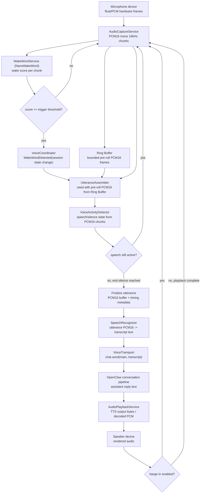
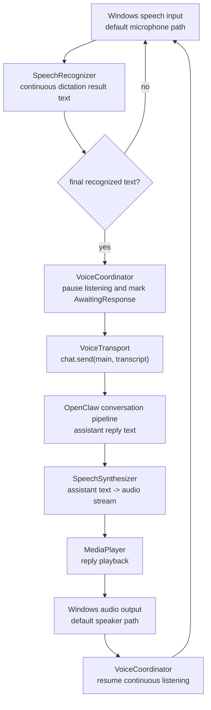
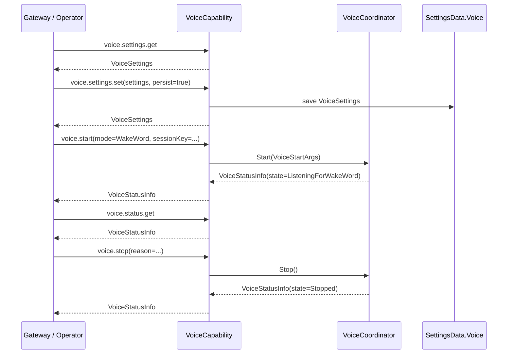

# Voice Mode Architecture

This document defines the voice subsystem for the Windows node only. It introduces the command surface, persisted settings schema, and minimum runtime boundaries needed to add Windows voice support without reshaping the existing node architecture.

## Goals

- Add a node-local voice mode with two activation modes: `wakeword` and `alwaysOn`
- Use NanoWakeWord for wakeword detection on-device
- Provide parity targets with the macOS app:
  - `WakeWord` maps to Voice Wake
  - `AlwaysOn` maps to Talk Mode
- Keep STT/TTS provider selection configurable, with Windows implementations as the default built-ins
- Keep provider-specific STT/TTS concerns separate from the Windows node by default
- Reuse the existing node capability pattern instead of introducing a parallel control path

## Non-Goals

- True full-duplex or chunk-streaming audio transport between node and gateway
- Provider-specific STT/TTS routing in the Windows node
- Changes to unrelated project documentation

## Design Position

The Windows node should own device-local audio concerns:

- microphone capture
- wakeword detection
- silence detection / utterance segmentation
- speaker playback
- device enumeration and persisted local settings

OpenClaw remains responsible for conversation/session routing and upstream voice orchestration.

This keeps the Windows node lean for the first implementation and avoids introducing provider-routing settings before they are needed.

## macOS Parity Mapping

Windows voice mode aims for functional parity with the existing macOS voice surfaces:

| Windows Mode | macOS Equivalent | Behavior |
|---|---|---|
| `WakeWord` | Voice Wake | passively listen for a trigger phrase, capture one utterance, then submit after end silence |
| `AlwaysOn` | Talk Mode | continuous listen -> think -> speak loop with barge-in support, while still remaining turn-based rather than true simultaneous duplex audio |

For v1 on Windows, `AlwaysOn` is Talk Mode parity, not a new full-duplex transport.
The current implementation is still turn-based: listen, send transcript, wait, speak, resume listening.

## Transport Boundary

For macOS parity, `AlwaysOn` should follow Talk Mode's documented control flow:

- the node captures audio locally
- local speech recognition turns that audio into transcript text
- if the tray chat window is open and ready, the final transcript is submitted through the tray chat window's own compose/send path
- otherwise, the transcript is sent to OpenClaw via direct `chat.send` on the main session
- OpenClaw returns the assistant reply as normal chat output
- the node performs local TTS playback of that reply

That means the first Windows parity target is transcript transport, not raw audio upload. Streaming audio frames in or out of OpenClaw remains a future protocol extension, not part of this design.

The current Windows implementation uses a voice-local operator connection inside the tray app while node mode is active. That sidecar connection exists to carry assistant chat events for `AlwaysOn`, and to provide a fallback direct `chat.send` path when the tray chat window is not open.

## Tray Chat Integration Decision

Voice mode and typed chat must remain part of the same user-visible conversation in the tray app. Creating a separate "voice session" would reduce implementation complexity, but it would make the chat experience harder to understand:

- voice utterances would not appear in the same tray chat history as typed messages
- the user would need to reason about two concurrent sessions for one tray app
- voice replies and typed replies could diverge across windows

### Problem Encountered

When `AlwaysOn` sends transcript text to the main OpenClaw session, the upstream session can include scaffolding such as `<relevant-memories>...</relevant-memories>` in the rendered user message body shown in the tray chat window.

That produced two UX problems:

- the tray chat bubble did not show the clean spoken transcript the user actually said
- the embedded tray chat window had no draft/update API for showing interim STT hypotheses while the user was still speaking

### Routes Examined

1. Dedicated voice session
   - technically clean from a transport perspective
   - rejected because it fragments the tray chat experience and is confusing for users
2. Upstream OpenClaw change to suppress memory scaffolding for voice turns
   - desirable long-term if OpenClaw exposes a first-class voice-aware chat surface
   - rejected for the current phase because this Windows tray feature must work without waiting for upstream protocol/UI changes
3. Tray-local DOM mediation in the embedded chat window
   - chosen
   - keeps a single session and single tray chat history
   - allows interim hypotheses to appear in the tray compose box in near real time
   - allows the tray app to submit through the same UI path as typed messages when the tray chat window is open
4. Hybrid submission path
   - chosen
   - when the tray chat window is open, voice submits through the chat window DOM send path
   - when the tray chat window is closed or unavailable, voice falls back to direct `chat.send`
   - preserves windowless voice mode without forcing the transport layer to depend on WebView availability

### Chosen Approach

The tray app keeps a tray-local interim transcript buffer for the current utterance, independent of whether the chat window is open.

The embedded [WebChatWindow.xaml.cs](C:/dev/openclaw-windows-node/src/OpenClaw.Tray.WinUI/Windows/WebChatWindow.xaml.cs) owns the tray-local chat integration layer:

- interim STT hypotheses from Windows speech recognition are injected into the tray chat compose box while the user is speaking
- if the chat window opens during an utterance, the current buffered transcript is copied into the compose box immediately
- if the chat window closes during an utterance, voice continues windowless and the final utterance still submits
- if the chat window is open and ready when the utterance finalizes, the tray app either auto-submits through the page's own send path or leaves the draft for manual send, depending on `Voice.AlwaysOn.ChatWindowSubmitMode`
- in `WaitForUser` mode, voice capture pauses after finalizing the draft so the next utterance does not overwrite the unsent message
- if the chat window is not open or not ready, the voice service falls back to direct `chat.send`
- rendered chat content inside the tray window is still sanitized to remove `<relevant-memories>...</relevant-memories>` blocks as a fallback for messages that were sent while windowless

This is intentionally a tray-local integration decision, not a protocol-level rewrite of the stored upstream transcript.

### Tradeoffs

- preserves a single visible conversation for the user
- avoids a second voice-only session in the tray UI
- when the tray chat window is open, voice follows the same send path as typed tray-chat messages
- depends on DOM integration inside the embedded WebView chat surface because OpenClaw does not currently expose a dedicated draft/update or voice-submit API for the tray app
- still requires a direct fallback path for windowless voice mode
- only affects the tray app chat window; other clients still render upstream content according to their own rules

## Provider Selection

Voice settings now carry explicit provider ids for both STT and TTS:

- `Voice.SpeechToTextProviderId`
- `Voice.TextToSpeechProviderId`

The built-in default for both is `windows`.

Runtime behavior in the current phase:

- `windows` is implemented for both STT and TTS
- non-Windows providers can be selected and persisted now
- unsupported providers fall back to Windows at runtime with a status warning

### Local Provider Catalog

Additional provider entries are supplied through a local catalog file:

- `%APPDATA%\\OpenClawTray\\voice-providers.json`

Example:

```json
{
  "speechToTextProviders": [
    {
      "id": "windows",
      "name": "Windows Speech Recognition",
      "runtime": "windows",
      "enabled": true,
      "description": "Built-in Windows dictation and speech recognition."
    },
    {
      "id": "minimax",
      "name": "MiniMax Speech To Text",
      "runtime": "gateway",
      "enabled": true,
      "description": "Planned future provider."
    }
  ],
  "textToSpeechProviders": [
    {
      "id": "windows",
      "name": "Windows Speech Synthesis",
      "runtime": "windows",
      "enabled": true,
      "description": "Built-in Windows text-to-speech playback."
    },
    {
      "id": "elevenlabs",
      "name": "ElevenLabs",
      "runtime": "gateway",
      "enabled": true,
      "description": "Planned future provider."
    }
  ]
}
```

This file only defines selectable providers. It does not carry API keys.

### OpenClaw Configuration Discovery

It may be technically possible to inspect parts of the OpenClaw configuration surface to infer preferred providers. However, the documented config protocol notes that sensitive fields have no redaction layer, so automatically pulling provider credentials into the Windows tray is not a safe default.

Because of that, this design keeps provider selection local for now:

- local tray settings choose the preferred STT/TTS provider ids
- OpenClaw remains the conversation endpoint for `chat.send`
- future provider adapters can decide whether they use local credentials, gateway-owned credentials, or both

For `WakeWord`, trigger words are gateway-owned global state. The Windows node should eventually consume the same shared trigger list and keep only a local enabled/disabled toggle plus device/runtime settings.

## Command Surface

The voice subsystem is introduced as a new node capability category: `voice`.

### Commands

| Command | Purpose | Request Payload | Response Payload |
|---|---|---|---|
| `voice.devices.list` | Enumerate input/output audio devices | none | `VoiceAudioDeviceInfo[]` |
| `voice.settings.get` | Return the effective voice configuration | none | `VoiceSettings` |
| `voice.settings.set` | Update the voice configuration | `VoiceSettingsUpdateArgs` | `VoiceSettings` |
| `voice.status.get` | Return runtime voice status | none | `VoiceStatusInfo` |
| `voice.start` | Start the voice runtime with the supplied or persisted mode | `VoiceStartArgs` | `VoiceStatusInfo` |
| `voice.stop` | Stop the voice runtime | `VoiceStopArgs` | `VoiceStatusInfo` |

### Payload Types

- `VoiceSettings`
- `VoiceWakeWordSettings`
- `VoiceAlwaysOnSettings`
- `VoiceAudioDeviceInfo`
- `VoiceStatusInfo`
- `VoiceStartArgs`
- `VoiceStopArgs`
- `VoiceSettingsUpdateArgs`

These contracts are defined in [VoiceModeSchema.cs](C:/dev/openclaw-windows-node/src/OpenClaw.Shared/VoiceModeSchema.cs).

## Settings Schema

Voice settings are persisted as `SettingsData.Voice` in [SettingsData.cs](C:/dev/openclaw-windows-node/src/OpenClaw.Shared/SettingsData.cs).

### Effective Schema

```json
{
  "Voice": {
    "Mode": "WakeWord",
    "Enabled": true,
    "SpeechToTextProviderId": "windows",
    "TextToSpeechProviderId": "windows",
    "InputDeviceId": "default-mic",
    "OutputDeviceId": "default-speaker",
    "SampleRateHz": 16000,
    "CaptureChunkMs": 80,
    "BargeInEnabled": true,
    "WakeWord": {
      "Engine": "NanoWakeWord",
      "ModelId": "hey_openclaw",
      "TriggerThreshold": 0.65,
      "TriggerCooldownMs": 2000,
      "PreRollMs": 1200,
      "EndSilenceMs": 900
    },
    "AlwaysOn": {
      "MinSpeechMs": 250,
      "EndSilenceMs": 900,
      "MaxUtteranceMs": 15000,
      "AutoSubmit": true,
      "ChatWindowSubmitMode": "AutoSend"
    }
  }
}
```

### Field Rationale

| Field | Purpose |
|---|---|
| `Mode` | Top-level activation mode: `Off`, `WakeWord`, `AlwaysOn` |
| `Enabled` | Global feature kill-switch independent of mode |
| `SpeechToTextProviderId` | Selected STT provider id from the local provider catalog |
| `TextToSpeechProviderId` | Selected TTS provider id from the local provider catalog |
| `InputDeviceId` / `OutputDeviceId` | Stable audio device binding |
| `SampleRateHz` | Shared capture sample rate, fixed to a speech-friendly default |
| `CaptureChunkMs` | Frame size for capture, VAD, and wakeword processing |
| `BargeInEnabled` | Allows microphone capture while audio playback is active |
| `WakeWord.*` | NanoWakeWord and post-trigger utterance capture tuning |
| `AlwaysOn.*` | Continuous-listening segmentation tuning |

### Complete Settings Definition

| Setting | Type | Default | Applies To | Meaning |
|---|---|---|---|---|
| `Voice.Mode` | enum | `Off` | all | Activation mode: `Off`, `WakeWord`, `AlwaysOn` |
| `Voice.Enabled` | bool | `false` | all | Master enable/disable flag for voice mode |
| `Voice.SpeechToTextProviderId` | string | `windows` | all | Preferred speech-to-text provider id |
| `Voice.TextToSpeechProviderId` | string | `windows` | all | Preferred text-to-speech provider id |
| `Voice.InputDeviceId` | string? | `null` | all | Preferred microphone device id; `null` means system default |
| `Voice.OutputDeviceId` | string? | `null` | all | Preferred speaker device id; `null` means system default |
| `Voice.SampleRateHz` | int | `16000` | all | Internal capture rate used for wakeword, VAD, and utterance assembly |
| `Voice.CaptureChunkMs` | int | `80` | all | Audio frame duration used by the capture loop |
| `Voice.BargeInEnabled` | bool | `true` | all | If `true`, microphone capture may continue while response audio is playing |
| `Voice.WakeWord.Engine` | string | `NanoWakeWord` | wakeword | Wakeword engine identifier |
| `Voice.WakeWord.ModelId` | string | `hey_openclaw` | wakeword | Wakeword model/profile identifier |
| `Voice.WakeWord.TriggerThreshold` | float | `0.65` | wakeword | Minimum score required to trigger wakeword activation |
| `Voice.WakeWord.TriggerCooldownMs` | int | `2000` | wakeword | Minimum delay before another wakeword trigger is accepted |
| `Voice.WakeWord.PreRollMs` | int | `1200` | wakeword | Buffered audio retained before the trigger point |
| `Voice.WakeWord.EndSilenceMs` | int | `900` | wakeword | Silence timeout used to finalize the post-trigger utterance |
| `Voice.AlwaysOn.MinSpeechMs` | int | `250` | always-on | Minimum detected speech duration before an utterance is treated as real input |
| `Voice.AlwaysOn.EndSilenceMs` | int | `900` | always-on | Silence timeout used to finalize an utterance |
| `Voice.AlwaysOn.MaxUtteranceMs` | int | `15000` | always-on | Hard cap on utterance length before forced submission/finalization |
| `Voice.AlwaysOn.AutoSubmit` | bool | `true` | always-on | If `true`, completed utterances are submitted immediately without extra confirmation |
| `Voice.AlwaysOn.ChatWindowSubmitMode` | enum | `AutoSend` | always-on | When the tray chat window is open, either auto-send the finalized utterance or leave it in the compose box for manual send |

At runtime today, those device ids are persisted and surfaced in the UI, but the v1 `AlwaysOn` path still uses the Windows system speech stack defaults for capture and playback.

## Component Architecture


## Runtime Data Flow

### Wakeword Mode



### Always-On Mode



## Processing Stages and Data Types

| Stage | Component | Input | Output |
|---|---|---|---|
| 1 | `SpeechRecognizer` | Windows microphone capture | recognized transcript text |
| 2a | `WakeWordService` | PCM16 chunk | wake score / trigger decision |
| 2b | `VoiceActivityDetector` | PCM16 chunk | speech/silence state |
| 3 | `Ring Buffer` | PCM16 chunk stream | bounded pre-roll PCM16 window |
| 4 | `UtteranceAssembler` | pre-roll + live PCM16 chunks | utterance PCM16 buffer |
| 5 | `SpeechRecognizer` | utterance PCM16 + timing metadata | transcript text |
| 6 | `VoiceTransport` | transcript text + session key | `chat.send` request / assistant reply text |
| 7 | `SpeechSynthesizer + MediaPlayer` | assistant reply text | speaker render stream |

## Control Flow



## Integration Boundaries

### Existing Components Reused

- `NodeService` remains the capability registration and lifecycle owner
- `SettingsData` remains the persisted JSON settings model
- `WindowsNodeClient` remains the gateway/node transport
- existing node capability registration remains the integration pattern
- current request/response transport remains the v1 control plane
- `AlwaysOn` parity should reuse existing `chat.send` message flow instead of inventing an audio-upload protocol

### New Components Expected Later

- `VoiceCapability` in `OpenClaw.Shared.Capabilities`
- `AudioCaptureService` in `OpenClaw.Tray.WinUI.Services`
- `WakeWordService` in `OpenClaw.Tray.WinUI.Services`
- `VoiceCoordinator` in `OpenClaw.Tray.WinUI.Services`
- `AudioPlaybackService` in `OpenClaw.Tray.WinUI.Services`

## Why Provider Support Is Abstracted

Minimax and ElevenLabs are valid future targets, but binding provider choice into the Windows node now would introduce:

- duplicated provider integration work already handled by OpenClaw
- local credential management on Windows
- tighter coupling between node runtime and vendor APIs

For the first implementation, the Windows node should manage local audio behavior, local speech recognition, and local playback while reusing existing OpenClaw message flows for conversation. If provider routing becomes a real requirement later, it can be added back without changing the core activation-mode model.
