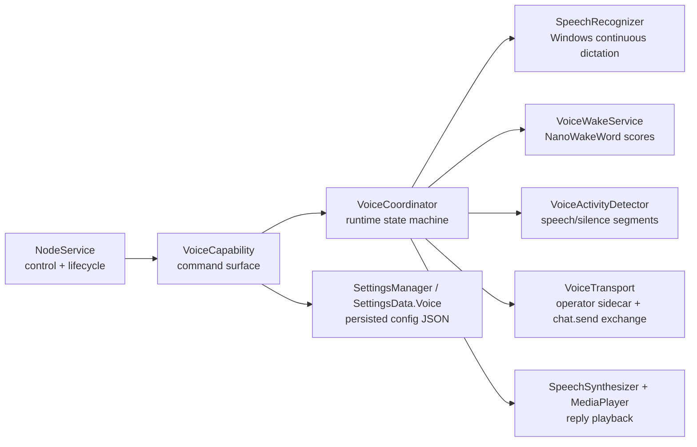
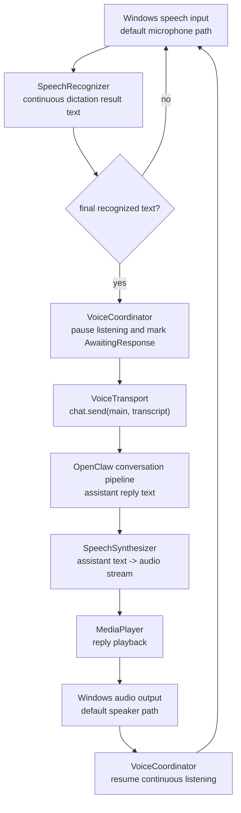
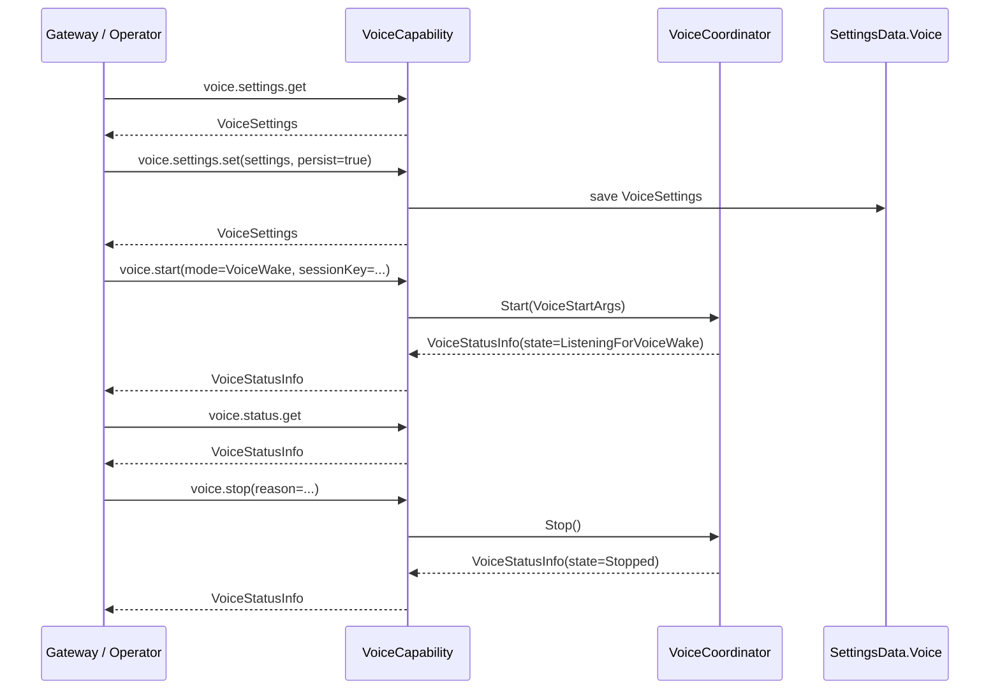

# Voice Mode Architecture

This document defines the voice subsystem for the Windows node only. It introduces the command surface, persisted settings schema, and minimum runtime boundaries needed to add Windows voice support without reshaping the existing node architecture.

## Goals

- Add a node-local voice mode with two activation modes: `VoiceWake` and `TalkMode`
- Utilise minimal touch points to the existing app to reduce the potential for screw-ups.
- Use NanoWakeWord for wakeword detection on-device
- Present the user-facing mode names as `Voice Wake` and `Talk Mode`
- Keep STT/TTS provider selection configurable, with Windows implementations as the default built-ins
- Implement `MiniMax` TTS and `ElevenLabs` TTS as required non-Windows providers after the Windows baseline
- Reuse the existing node capability pattern instead of introducing a parallel control path

## Non-Goals

- True full-duplex or chunk-streaming audio transport between node and gateway
- Arbitrary provider proliferation before the required `MiniMax` / `ElevenLabs` TTS support is in place
- Changes to unrelated project documentation

## Design Position

The Windows node should own device-local audio concerns:

- microphone capture
- wakeword detection
- silence detection / utterance segmentation
- speaker playback
- device enumeration and persisted local settings

OpenClaw remains responsible for conversation/session routing and upstream voice orchestration.

This keeps the Windows node lean for the first implementation and avoids introducing provider-routing settings before they are needed.

## Visible Mode Names

The tray app now uses user-facing names rather than exposing the internal enum names directly:

| Internal Mode | Visible Name | Availability |
|---|---|---|
| `Off` | Off | available |
| `VoiceWake` | Voice Wake | visible but disabled for now |
| `TalkMode` | Talk Mode | available |

The contracts and persisted settings now use `VoiceWake` and `TalkMode` as well.

## Transport Boundary

`TalkMode` follows the current talk-mode style control flow:

- the node captures audio locally
- local speech recognition turns that audio into transcript text
- if the tray chat window is open and ready, the final transcript is submitted through the tray chat window's own compose/send path
- otherwise, the transcript is sent to OpenClaw via direct `chat.send` on the main session
- OpenClaw returns the assistant reply as normal chat output
- the node performs local TTS playback of that reply

That means the first Windows target is transcript transport, not raw audio upload. Streaming audio frames in or out of OpenClaw remains a future protocol extension, not part of this design.

The current Windows implementation uses a voice-local operator connection inside the tray app while node mode is active. That sidecar connection exists to carry assistant chat events for `TalkMode`, and to provide a fallback direct `chat.send` path when the tray chat window is not open.

## Speech Output Latency

Microsoft's Azure Speech SDK latency guidance is specifically about speech synthesis, not speech recognition, so it applies to Windows voice output rather than voice input. Source: [Lower speech synthesis latency using Speech SDK](https://learn.microsoft.com/en-us/azure/ai-services/speech-service/how-to-lower-speech-synthesis-latency?pivots=programming-language-csharp).

The current Windows implementation already follows the guidance where it maps cleanly:

- the Windows `SpeechSynthesizer` is created once per `TalkMode` runtime and reused for subsequent replies
- cloud TTS uses a shared static `HttpClient`, so HTTP/TLS connections can be reused across replies
- cloud requests use `ResponseHeadersRead`, which lets the client observe response-header arrival without waiting for full buffering first
- the tray app now logs per-reply synthesis timings for both Windows and cloud TTS paths so latency can be measured directly during testing

The main remaining gap is streaming playback from the first audio chunk. The Azure guidance recommends chunked playback as soon as the first audio arrives, but the current Windows implementation still waits for a complete playable stream before starting output:

- Windows `SpeechSynthesizer` is used through `SynthesizeTextToStreamAsync`, which returns a complete stream for playback
- MiniMax currently returns audio inside a JSON body, so playback cannot begin until the full response is available
- ElevenLabs is currently integrated through the non-streaming convert contract in the provider catalog

So the current design minimizes avoidable setup and connection latency, but does not yet implement first-chunk playback streaming.

## Tray Chat Integration Decision

Voice mode and typed chat must remain part of the same user-visible conversation in the tray app. Creating a separate "voice session" would reduce implementation complexity, but it would make the chat experience harder to understand:

- voice utterances would not appear in the same tray chat history as typed messages
- the user would need to reason about two concurrent sessions for one tray app
- voice replies and typed replies could diverge across windows

### Problem Encountered

When `TalkMode` sends transcript text to the main OpenClaw session, the upstream session can include scaffolding such as `<relevant-memories>...</relevant-memories>` in the rendered user message body shown in the tray chat window.

That produced two UX problems:

- the tray chat bubble did not show the clean spoken transcript the user actually said
- the embedded tray chat window had no draft/update API for showing interim STT hypotheses while the user was still speaking

### Routes Examined

1. Dedicated voice session
   - technically clean from a transport perspective
   - rejected because it fragments the tray chat experience and is confusing for users
2. Upstream OpenClaw change to suppress memory scaffolding for voice turns
   - desirable long-term if OpenClaw exposes a first-class voice-aware chat surface
   - rejected for the current phase because this Windows tray feature must work without waiting for upstream protocol/UI changes
3. Tray-local DOM mediation in the embedded chat window
   - chosen
   - keeps a single session and single tray chat history
   - allows interim hypotheses to appear in the tray compose box in near real time
   - allows the tray app to submit through the same UI path as typed messages when the tray chat window is open
4. Hybrid submission path
   - chosen
   - when the tray chat window is open, voice submits through the chat window DOM send path
   - when the tray chat window is closed or unavailable, voice falls back to direct `chat.send`
   - preserves windowless voice mode without forcing the transport layer to depend on WebView availability

### Chosen Approach

The tray app keeps a tray-local interim transcript buffer for the current utterance, independent of whether the chat window is open.

The embedded [WebChatWindow.xaml.cs](../src/OpenClaw.Tray.WinUI/Windows/WebChatWindow.xaml.cs) owns the tray-local chat integration layer:

- interim STT hypotheses from Windows speech recognition are injected into the tray chat compose box while the user is speaking
- if the chat window opens during an utterance, the current buffered transcript is copied into the compose box immediately
- if the chat window closes during an utterance, voice continues windowless and the final utterance still submits
- if the chat window is open and ready when the utterance finalizes, the tray app either auto-submits through the page's own send path or leaves the draft for manual send, depending on `Voice.TalkMode.ChatWindowSubmitMode`
- in `WaitForUser` mode, voice capture pauses after finalizing the draft so the next utterance does not overwrite the unsent message
- if the chat window is not open or not ready, the voice service falls back to direct `chat.send`
- rendered chat content inside the tray window is still sanitized to remove `<relevant-memories>...</relevant-memories>` blocks as a fallback for messages that were sent while windowless

This is intentionally a tray-local integration decision, not a protocol-level rewrite of the stored upstream transcript.

### Tradeoffs

- preserves a single visible conversation for the user
- avoids a second voice-only session in the tray UI
- when the tray chat window is open, voice follows the same send path as typed tray-chat messages
- depends on DOM integration inside the embedded WebView chat surface because OpenClaw does not currently expose a dedicated draft/update or voice-submit API for the tray app
- still requires a direct fallback path for windowless voice mode
- only affects the tray app chat window; other clients still render upstream content according to their own rules

## Provider Selection

Voice settings now carry explicit provider ids for both STT and TTS:

- `Voice.SpeechToTextProviderId`
- `Voice.TextToSpeechProviderId`

The built-in default for both is `windows`.

Runtime behavior in the current phase:

- `windows` is implemented for both STT and TTS
- built-in catalog entries exist for both `minimax` and `elevenlabs` TTS
- `minimax` defaults to `speech-2.8-turbo` and `English_MatureBoss`
- `elevenlabs` defaults to `eleven_multilingual_v2` and a user-supplied voice id
- non-Windows providers can be selected and persisted now
- unsupported providers fall back to Windows at runtime with a status warning

### Provider Catalog

The provider catalog now ships with the tray app as a bundled asset:

- `Assets\\voice-providers.json`

Example:

```json
{
  "speechToTextProviders": [
    {
      "id": "windows",
      "name": "Windows Speech Recognition",
      "runtime": "windows",
      "enabled": true,
      "description": "Built-in Windows dictation and speech recognition."
    },
  ],
  "textToSpeechProviders": [
    {
      "id": "windows",
      "name": "Windows Speech Synthesis",
      "runtime": "windows",
      "enabled": true,
      "description": "Built-in Windows text-to-speech playback."
    },
    {
      "id": "minimax",
      "name": "MiniMax",
      "runtime": "cloud",
      "enabled": true,
      "description": "Cloud TTS using the MiniMax HTTP text-to-speech API.",
      "settings": [
        { "key": "apiKey", "label": "API key", "secret": true },
        {
          "key": "model",
          "label": "Model",
          "defaultValue": "speech-2.8-turbo",
          "options": [
            "speech-2.5-turbo-preview",
            "speech-02-turbo",
            "speech-02-hd",
            "speech-2.6-turbo",
            "speech-2.6-hd",
            "speech-2.8-turbo",
            "speech-2.8-hd"
          ]
        },
        { "key": "voiceId", "label": "Voice ID", "defaultValue": "English_MatureBoss" },
        {
          "key": "voiceSettingsJson",
          "label": "Voice settings JSON",
          "defaultValue": "\"voice_setting\": { \"voice_id\": {{voiceId}}, \"speed\": 1, \"vol\": 1, \"pitch\": 0 }",
          "placeholder": "\"voice_setting\": { \"voice_id\": \"English_MatureBoss\", \"speed\": 1, \"vol\": 1, \"pitch\": 0 }"
        }
      ],
      "textToSpeechHttp": {
        "endpointTemplate": "https://api.minimax.io/v1/t2a_v2",
        "httpMethod": "POST",
        "authenticationHeaderName": "Authorization",
        "authenticationScheme": "Bearer",
        "apiKeySettingKey": "apiKey",
        "requestContentType": "application/json",
        "requestBodyTemplate": "{ \"model\": {{model}}, \"text\": {{text}}, \"stream\": false, \"language_boost\": \"English\", \"output_format\": \"hex\", {{voiceSettingsJson}}, \"audio_setting\": { \"sample_rate\": 32000, \"bitrate\": 128000, \"format\": \"mp3\", \"channel\": 1 } }",
        "responseAudioMode": "hexJsonString",
        "responseAudioJsonPath": "data.audio",
        "responseStatusCodeJsonPath": "base_resp.status_code",
        "responseStatusMessageJsonPath": "base_resp.status_msg",
        "successStatusValue": "0",
        "outputContentType": "audio/mpeg"
      }
    },
    {
      "id": "elevenlabs",
      "name": "ElevenLabs",
      "runtime": "cloud",
      "enabled": true,
      "description": "Cloud TTS using the ElevenLabs create speech API.",
      "settings": [
        { "key": "apiKey", "label": "API key", "secret": true },
        {
          "key": "model",
          "label": "Model",
          "defaultValue": "eleven_multilingual_v2",
          "options": [
            "eleven_flash_v2_5",
            "eleven_turbo_v2_5",
            "eleven_multilingual_v2",
            "eleven_monolingual_v1"
          ]
        },
        { "key": "voiceId", "label": "Voice ID", "placeholder": "Enter an ElevenLabs voice ID" },
        {
          "key": "voiceSettingsJson",
          "label": "Voice settings JSON",
          "defaultValue": "\"voice_settings\": null",
          "placeholder": "\"voice_settings\": { \"stability\": 0.5, \"similarity_boost\": 0.8 }"
        }
      ],
      "textToSpeechHttp": {
        "endpointTemplate": "https://api.elevenlabs.io/v1/text-to-speech/{{voiceId}}?output_format=mp3_44100_128",
        "httpMethod": "POST",
        "authenticationHeaderName": "xi-api-key",
        "apiKeySettingKey": "apiKey",
        "requestContentType": "application/json",
        "requestBodyTemplate": "{ \"text\": {{text}}, \"model_id\": {{model}}, {{voiceSettingsJson}} }",
        "responseAudioMode": "binary",
        "outputContentType": "audio/mpeg"
      }
    }
  ]
}
```

For HTTP-backed TTS providers, the catalog carries the request/response contract. That allows a new provider to be added by shipping an updated catalog file with the app, as long as it follows the same general HTTP template approach.

This file defines provider metadata and HTTP contracts. It does not carry API keys.

### Local Provider Configuration

That means the current design is:

- local tray settings choose the preferred STT/TTS provider ids
- provider API keys and editable values are stored in `%APPDATA%\\OpenClawTray\\settings.json` under `VoiceProviderConfiguration`
- OpenClaw remains the conversation endpoint for `chat.send`
- the shipped provider catalog remains metadata-only and must not contain secrets

This is an intentional short-term design choice so the Windows tray app can use cloud TTS providers without inventing a second catalog file for secrets. It can be revisited later if provider ownership is split differently.

Current configuration values are keyed by provider id. The built-in providers use:

- `apiKey`
- `model`
- `voiceId`
- `voiceSettingsJson`

When the selected TTS provider in Settings is not `windows`, the tray app shows provider-specific fields in the configuration form so the user can enter or edit:

- API key
- model
- voice id
- voice settings JSON

If a provider setting definition includes an `options` list, the settings UI renders that setting as a drop-down instead of a free-text field. That is how built-in cloud providers expose a provider-level choice plus a separate model choice without recompilation.

If a provider setting definition is marked as JSON, the value is inserted into the provider request template as a raw JSON fragment rather than a quoted string. That allows the provider catalog to define whether the user is entering:

- a bare object
- or a full keyed fragment such as `"voice_setting": { ... }`

without hard-coding provider-specific wrapper keys into the runtime.

For `VoiceWake`, trigger words are gateway-owned global state. The Windows node should eventually consume the same shared trigger list and keep only a local enabled/disabled toggle plus device/runtime settings.

## Command Surface

The voice subsystem is introduced as a new node capability category: `voice`.

### Commands

| Command | Purpose | Request Payload | Response Payload |
|---|---|---|---|
| `voice.devices.list` | Enumerate input/output audio devices | none | `VoiceAudioDeviceInfo[]` |
| `voice.settings.get` | Return the effective voice configuration | none | `VoiceSettings` |
| `voice.settings.set` | Update the voice configuration | `VoiceSettingsUpdateArgs` | `VoiceSettings` |
| `voice.status.get` | Return runtime voice status | none | `VoiceStatusInfo` |
| `voice.start` | Start the voice runtime with the supplied or persisted mode | `VoiceStartArgs` | `VoiceStatusInfo` |
| `voice.stop` | Stop the voice runtime | `VoiceStopArgs` | `VoiceStatusInfo` |

### Payload Types

- `VoiceSettings`
- `VoiceWakeSettings`
- `TalkModeSettings`
- `VoiceAudioDeviceInfo`
- `VoiceStatusInfo`
- `VoiceStartArgs`
- `VoiceStopArgs`
- `VoiceSettingsUpdateArgs`

These contracts are defined in [VoiceModeSchema.cs](../src/OpenClaw.Shared/VoiceModeSchema.cs).

## Settings Schema

Voice settings are persisted as `SettingsData.Voice` in [SettingsData.cs](../src/OpenClaw.Shared/SettingsData.cs).
Provider configuration is persisted as `SettingsData.VoiceProviderConfiguration` in the same local settings file.

The editable voice configuration now lives in the main Settings window.
The tray `Voice Mode` window is a read-only runtime status/detail surface with a shortcut back into Settings.

### Effective Schema

```json
{
  "Voice": {
    "Mode": "VoiceWake",
    "Enabled": true,
    "SpeechToTextProviderId": "windows",
    "TextToSpeechProviderId": "windows",
    "InputDeviceId": "default-mic",
    "OutputDeviceId": "default-speaker",
    "SampleRateHz": 16000,
    "CaptureChunkMs": 80,
    "BargeInEnabled": true,
    "VoiceWake": {
      "Engine": "NanoWakeWord",
      "ModelId": "hey_openclaw",
      "TriggerThreshold": 0.65,
      "TriggerCooldownMs": 2000,
      "PreRollMs": 1200,
      "EndSilenceMs": 900
    },
    "TalkMode": {
      "MinSpeechMs": 250,
      "EndSilenceMs": 900,
      "MaxUtteranceMs": 15000,
      "ChatWindowSubmitMode": "AutoSend"
    }
  },
  "VoiceProviderConfiguration": {
    "Providers": [
      {
        "ProviderId": "minimax",
        "Values": {
          "apiKey": "<local secret>",
          "model": "speech-2.8-turbo",
          "voiceId": "English_MatureBoss",
          "voiceSettingsJson": "\"voice_setting\": { \"voice_id\": \"English_MatureBoss\", \"speed\": 1, \"vol\": 1, \"pitch\": 0 }"
        }
      },
      {
        "ProviderId": "elevenlabs",
        "Values": {
          "apiKey": "<local secret>",
          "model": "eleven_multilingual_v2",
          "voiceId": "voice-id",
          "voiceSettingsJson": "\"voice_settings\": { \"stability\": 0.5, \"similarity_boost\": 0.8 }"
        }
      }
    ]
  }
}
```

### Field Rationale

| Field | Purpose |
|---|---|
| `Mode` | Top-level activation mode: `Off`, `VoiceWake`, `TalkMode` |
| `Enabled` | Global feature kill-switch independent of mode |
| `SpeechToTextProviderId` | Selected STT provider id from the local provider catalog |
| `TextToSpeechProviderId` | Selected TTS provider id from the local provider catalog |
| `InputDeviceId` / `OutputDeviceId` | Stable audio device binding |
| `SampleRateHz` | Shared capture sample rate, fixed to a speech-friendly default |
| `CaptureChunkMs` | Frame size for capture, VAD, and wakeword processing |
| `BargeInEnabled` | Allows microphone capture while audio playback is active |
| `VoiceWake.*` | NanoWakeWord and post-trigger utterance capture tuning |
| `TalkMode.*` | Continuous-listening segmentation tuning |

### Complete Settings Definition

| Setting | Type | Default | Applies To | Meaning |
|---|---|---|---|---|
| `Voice.Mode` | enum | `Off` | all | Activation mode: `Off`, `VoiceWake`, `TalkMode` |
| `Voice.Enabled` | bool | `false` | all | Master enable/disable flag for voice mode |
| `Voice.SpeechToTextProviderId` | string | `windows` | all | Preferred speech-to-text provider id |
| `Voice.TextToSpeechProviderId` | string | `windows` | all | Preferred text-to-speech provider id |
| `Voice.InputDeviceId` | string? | `null` | all | Preferred microphone device id; `null` means system default |
| `Voice.OutputDeviceId` | string? | `null` | all | Preferred speaker device id; `null` means system default |
| `Voice.SampleRateHz` | int | `16000` | all | Internal capture rate used for wakeword, VAD, and utterance assembly |
| `Voice.CaptureChunkMs` | int | `80` | all | Audio frame duration used by the capture loop |
| `Voice.BargeInEnabled` | bool | `true` | all | If `true`, microphone capture may continue while response audio is playing |
| `Voice.VoiceWake.Engine` | string | `NanoWakeWord` | voice wake | Voice Wake engine identifier |
| `Voice.VoiceWake.ModelId` | string | `hey_openclaw` | voice wake | Voice Wake model/profile identifier |
| `Voice.VoiceWake.TriggerThreshold` | float | `0.65` | voice wake | Minimum score required to trigger Voice Wake activation |
| `Voice.VoiceWake.TriggerCooldownMs` | int | `2000` | voice wake | Minimum delay before another Voice Wake trigger is accepted |
| `Voice.VoiceWake.PreRollMs` | int | `1200` | voice wake | Buffered audio retained before the trigger point |
| `Voice.VoiceWake.EndSilenceMs` | int | `900` | voice wake | Silence timeout used to finalize the post-trigger utterance |
| `Voice.TalkMode.MinSpeechMs` | int | `250` | talk mode | Minimum detected speech duration before an utterance is treated as real input |
| `Voice.TalkMode.EndSilenceMs` | int | `900` | talk mode | Silence timeout used to finalize an utterance |
| `Voice.TalkMode.MaxUtteranceMs` | int | `15000` | talk mode | Hard cap on utterance length before forced submission/finalization |
| `Voice.TalkMode.ChatWindowSubmitMode` | enum | `AutoSend` | talk mode | When the tray chat window is open, either auto-send the finalized utterance or leave it in the compose box for manual send |
| `VoiceProviderConfiguration.Providers[].ProviderId` | string | none | cloud providers | Provider id matching an `Assets\\voice-providers.json` entry |
| `VoiceProviderConfiguration.Providers[].Values["apiKey"]` | string? | `null` | cloud providers | API key sent using the provider contract's configured auth header |
| `VoiceProviderConfiguration.Providers[].Values["model"]` | string? | provider default | cloud providers | Model identifier inserted into the configured request template |
| `VoiceProviderConfiguration.Providers[].Values["voiceId"]` | string? | provider default | cloud providers | Voice id inserted into the configured request template or URL |
| `VoiceProviderConfiguration.Providers[].Values["voiceSettingsJson"]` | string? | provider default | cloud providers | Raw JSON fragment inserted into the configured request template; may be a keyed fragment like `"voice_setting": { ... }` |

At runtime today, those device ids are persisted and surfaced in the UI, but the v1 `TalkMode` path still uses the Windows system speech stack defaults for capture and playback.

## Component Architecture



## Runtime Data Flow

### Voice Wake Mode


### Always-On Mode



## Processing Stages and Data Types

| Stage | Component | Input | Output |
|---|---|---|---|
| 1 | `SpeechRecognizer` | Windows microphone capture | recognized transcript text |
| 2a | `VoiceWakeService` | PCM16 chunk | wake score / trigger decision |
| 2b | `VoiceActivityDetector` | PCM16 chunk | speech/silence state |
| 3 | `Ring Buffer` | PCM16 chunk stream | bounded pre-roll PCM16 window |
| 4 | `UtteranceAssembler` | pre-roll + live PCM16 chunks | utterance PCM16 buffer |
| 5 | `SpeechRecognizer` | utterance PCM16 + timing metadata | transcript text |
| 6 | `VoiceTransport` | transcript text + session key | `chat.send` request / assistant reply text |
| 7 | `SpeechSynthesizer + MediaPlayer` | assistant reply text | speaker render stream |

## Control Flow



## Integration Boundaries

### Existing Components Reused

- `NodeService` remains the capability registration and lifecycle owner
- `SettingsData` remains the persisted JSON settings model
- `WindowsNodeClient` remains the gateway/node transport
- existing node capability registration remains the integration pattern
- current request/response transport remains the v1 control plane
- `TalkMode` should reuse existing `chat.send` message flow instead of inventing an audio-upload protocol

### New Components Expected Later

- `VoiceCapability` in `OpenClaw.Shared.Capabilities`
- `AudioCaptureService` in `OpenClaw.Tray.WinUI.Services`
- `VoiceWakeService` in `OpenClaw.Tray.WinUI.Services`
- `VoiceCoordinator` in `OpenClaw.Tray.WinUI.Services`
- `AudioPlaybackService` in `OpenClaw.Tray.WinUI.Services`

## Provider Direction

Provider support is now part of the Windows voice subsystem roadmap, not a hypothetical extension:

- `MiniMax` and `ElevenLabs` TTS are both expressed through built-in catalog contracts
- additional HTTP TTS providers can be added by extending the shipped catalog without recompiling the tray app itself
- Windows STT remains the active speech-recognition baseline until a non-Windows STT provider is deliberately added

The Windows node still keeps provider choice bounded:

- local tray settings choose the provider ids
- local tray settings store the provider secrets and editable values for now
- OpenClaw still owns the conversation/session flow

This keeps the provider surface narrow while still meeting the required MiniMax/ElevenLabs support direction.
