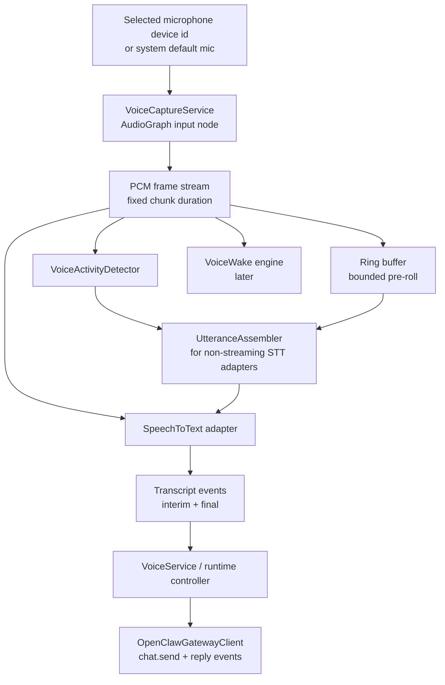
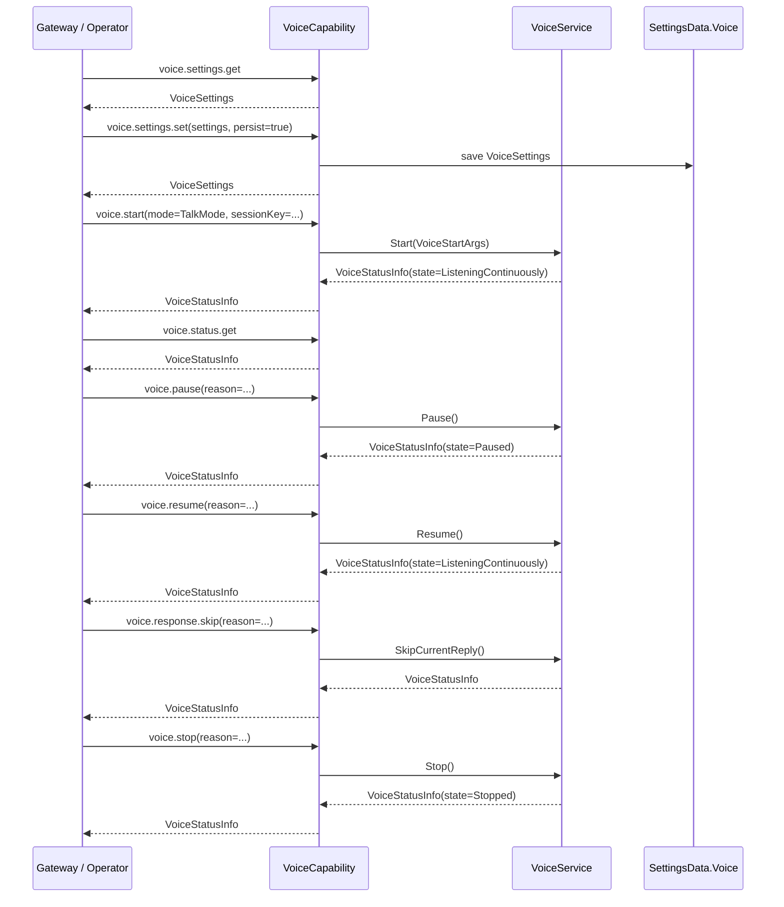

# Voice Mode Architecture
*Author: Nich Overend (NichUK@GitHub) - with @codex and @copilot*
https://github.com/openclaw/openclaw-windows-node


This document defines the voice subsystem for the Windows node only. It introduces the command surface, persisted settings schema, and minimum runtime boundaries needed to add Windows voice support without reshaping the existing node architecture.

## Goals

- Add a node-local voice mode with two activation modes: `VoiceWake` and `TalkMode`
- Utilise minimal touch points to the existing app to reduce the potential for screw-ups
- Use NanoWakeWord for wakeword detection on-device
- Present the user-facing mode names as `Voice Wake` and `Talk Mode`
- Keep STT/TTS provider selection configurable, with Windows implementations as the default built-in baseline
- Implement `MiniMax` TTS and `ElevenLabs` TTS as required non-Windows providers after the Windows baseline
- Make adding new voice providers an update to a Json catalog, rather than requiring code changes where possible
- Reuse the existing node capability pattern instead of introducing a parallel control path
- Ensure that the voice sub-system is extensible
- Ensure that the voice sub-system is controllable from other applications

## Non-Goals

- True full-duplex or chunk-streaming audio transport between node and gateway
- Subtantial changes to the existing project

## Design Position

The Windows node should own device-local audio concerns:

- microphone capture
- wakeword detection
- silence detection / utterance segmentation
- speaker playback
- device enumeration and persisted local settings

OpenClaw remains responsible for conversation/session routing and upstream voice orchestration.

This keeps the Windows node lean for the first implementation and avoids introducing provider-routing settings before they are needed.

## Visible Mode Names

The tray app now uses user-facing names (borrowed from the macOS app) rather than exposing the internal enum names directly:

| Internal Mode | Visible Name | Availability |
|---|---|---|
| `Off` | Off | available |
| `VoiceWake` | Voice Wake | visible but disabled for now |
| `TalkMode` | Talk Mode | available |

The contracts and persisted settings now use `VoiceWake` and `TalkMode` as well.

## Transport Boundary

`TalkMode` follows the current talk-mode style control flow:

- the node captures audio locally
- local speech recognition turns that audio into transcript text on the active STT route
- interim hypotheses are surfaced live, but only final `Medium` or `High` confidence recognizer results are submitted
- if speech activity ends without any usable final transcript surviving, Talk Mode now clears the draft and gives a short local repeat prompt instead of silently doing nothing
- the compact voice repeater window, when open, shows the live transcript draft plus local sent/received turns in a single scrolling surface
- the tray chat window, when open, mirrors the live transcript draft into the compose box only
- the finalized transcript is always sent to OpenClaw via direct `chat.send` on the voice mode target session, which is currently hardcoded in the tray app to `agent:main:main`
- OpenClaw returns the assistant reply as normal chat output
- the node performs local or remote TTS playback of that reply
- assistant replies are queued locally and spoken sequentially, with a short (500 ms currently) pause between queued replies so overlapping responses are not lost
- if a reply arrives after the normal 45-second wait timeout, the tray still accepts and speaks that late reply for a short bounded grace window (currently 120s) so slow upstream responses are not silently lost
- assistant replies are currently accepted from either `agent:main:main` or the `main` alias so the tray can tolerate upstream session-key normalisation differences

To avoid obvious duplicate sends from the Windows recognizer, exact duplicate final transcripts are suppressed within a short 750 ms window.

The current Windows implementation uses a voice-local operator connection inside the tray app while node mode is active. That connection carries assistant chat events for `TalkMode`, while the recognized transcript is always sent through the tray app's direct `chat.send` path.

## Voice APIs

The Windows tray implementation now has two API layers:

- shared node-capability commands in `OpenClaw.Shared`
- in-process tray interfaces used by the windows/forms

### Shared Capability Commands

The node capability command surface is:

- `voice.devices.list`
- `voice.settings.get`
- `voice.settings.set`
- `voice.status.get`
- `voice.start`
- `voice.stop`
- `voice.pause`
- `voice.resume`
- `voice.response.skip`

These commands are defined in [VoiceModeSchema.cs](../src/OpenClaw.Shared/VoiceModeSchema.cs) and handled by [VoiceCapability.cs](../src/OpenClaw.Shared/Capabilities/VoiceCapability.cs).

`voice.settings.get` / `voice.settings.set` are the configuration API.

`voice.start` / `voice.stop` / `voice.pause` / `voice.resume` / `voice.response.skip` are the runtime control API.

### Status Surface

`VoiceStatusInfo` now carries the basic state needed by control surfaces:

- mode
- runtime state
- session key
- input/output device ids
- last wake / last utterance timestamps
- pending reply count
- whether a reply can currently be skipped
- current reply preview
- last error

### In-Process Tray Interfaces

The tray app also exposes in-process interfaces so its own windows do not need to bind directly to the concrete `VoiceService` implementation:

- `IVoiceConfigurationApi`
  - get voice settings
  - update voice settings
  - list devices
  - get provider catalog
  - get/set provider configuration
- `IVoiceRuntimeControlApi`
  - get runtime status
  - start / stop
  - pause / resume
  - skip current reply
- `IVoiceRuntime`
  - transcript draft and conversation events for chat integration

This now powers multiple tray-local voice surfaces, including the compact voice repeater window.

### Can the Settings Form Use This API?

Yes. The Settings form can use the configuration API cleanly.

The current tray implementation now uses the voice configuration interface for:

- provider catalog loading
- device enumeration
- applying updated voice settings / provider configuration on save

That means the settings UI is no longer hard-wired only to concrete `VoiceService` internals for its voice-specific behavior.

## Speech Output Implementation

In order to reduce output latency as much as possible, the current Windows implementation has made the following implementation decisions:

- the Windows `SpeechSynthesizer` is created once per `TalkMode` runtime and reused for subsequent replies
  - Frankly, no one will probably use it, but everyone has it, so...
- cloud TTS uses a shared static `HttpClient`, so HTTP/TLS connections can be reused across replies
- cloud requests use `ResponseHeadersRead`, which lets the client observe response-header arrival without waiting for full buffering first
- the tray app now logs per-reply synthesis timings for both Windows and cloud TTS paths so latency can be measured directly during testing

The main remaining gap is streaming playback from the first audio chunk. Best practice recommends chunked playback as soon as the first audio arrives, but the current implementation still waits for a complete playable stream before starting output (but not for long...):

- Windows `SpeechSynthesizer` is used through `SynthesizeTextToStreamAsync`, which returns a complete stream for playback
- MiniMax now uses the provider catalog's WebSocket TTS contract, but the current player still waits for a complete playable stream before output starts
- ElevenLabs now uses the provider catalog's `stream-input` WebSocket contract, but the current player still waits for a complete playable stream before output starts

So the current design minimizes avoidable setup and connection latency, but does not yet implement first-chunk playback streaming. This is however, planned for an early release (I'm working on it next).

## Tray Chat Integration Decision

Ideally Voice mode and typed chat should remain part of the same user-visible conversation in the web chat UI, however this proved difficult to achieve, as the gateway treated a message stream from the tray app seperately to that from the WebUI, even with the same session key.

The only way of achieving this vaguely reliably seemed to be to locally insert messages into the DOM, but as this was a brittle, hacky solution, it was disgarded.

### Chosen Approach

It was therefore decided to create a separate *voice repeater form* to serve as a message window for voice, as well as making the messages available via toasts.

The tray app keeps a tray-local interim transcript buffer for the current utterance, independent of whether any chat window or voice repeater form is open.

## Provider Selection

Voice settings now carry explicit provider ids for both STT and TTS:

- `Voice.SpeechToTextProviderId`
- `Voice.TextToSpeechProviderId`

The built-in default for both is `windows`.

Runtime behavior in the current phase:

- `windows` is implemented for both STT and TTS
- the `windows` STT route is a pure `Windows.Media.SpeechRecognition.SpeechRecognizer` path with no `AudioGraph` dependency
- `windows` STT is currently treated as `half-duplex, non-streamed`
- `http/ws` is now catalogued as a visible "coming soon" STT slot for generic streaming HTTP/WebSocket adapters
- built-in catalog entries exist for both `minimax` and `elevenlabs` TTS
- `minimax` defaults to `speech-2.8-turbo` and `English_MatureBoss` at present
- `minimax` now uses a catalog-driven WebSocket contract for synchronous TTS
- `elevenlabs` defaults to `eleven_multilingual_v2` and voice id `6aDn1KB0hjpdcocrUkmq (Tiffany)` for now
- only currently usable providers are selectable in Settings
- `sherpa-onnx` is visible but greyed out as a coming-soon local embedded route
- unsupported providers fall back to Windows at runtime with a status warning

### Settings Surface Notes

The Settings panel now shows short inline descriptions for:

- the selected voice mode
- the selected speech-to-text provider
- the selected text-to-speech provider

Those provider descriptions are drawn directly from the provider catalog.

When `Windows Speech Recognition` is selected for STT, the Settings panel now forces both audio device pickers back to the system defaults and greys them out. That matches the current Windows route limitation and avoids advertising per-device microphone routing that does not exist on this route yet.

### Provider Catalog

The provider catalog now ships with the tray app as a bundled asset:

- `Assets\\voice-providers.json`

Example:

```json
{
  "speechToTextProviders": [
    {
      "id": "windows",
      "name": "Windows Speech Recognition",
      "runtime": "windows",
      "enabled": true,
      "description": "Built-in Windows.Media speech recognition, half-duplex, non-streamed."
    },
    {
      "id": "http-ws",
      "name": "http/ws",
      "runtime": "streaming",
      "enabled": false,
      "visibleInSettings": true,
      "selectable": false,
      "description": "Will support most cloud and local stand-alone models full or half-duplex, streaming."
    },
  ],
  "textToSpeechProviders": [
    {
      "id": "windows",
      "name": "Windows Speech Synthesis",
      "runtime": "windows",
      "enabled": true,
      "description": "Built-in Windows text-to-speech playback."
    },
    {
      "id": "minimax",
      "name": "MiniMax",
      "runtime": "cloud",
      "enabled": true,
      "description": "Cloud TTS using the MiniMax WebSocket text-to-speech API.",
      "settings": [
        { "key": "apiKey", "label": "API key", "secret": true },
        {
          "key": "model",
          "label": "Model",
          "defaultValue": "speech-2.8-turbo",
          "options": [
            "speech-2.5-turbo-preview",
            "speech-02-turbo",
            "speech-02-hd",
            "speech-2.6-turbo",
            "speech-2.6-hd",
            "speech-2.8-turbo",
            "speech-2.8-hd"
          ]
        },
        { "key": "voiceId", "label": "Voice ID", "defaultValue": "English_MatureBoss" },
        {
          "key": "voiceSettingsJson",
          "label": "Voice settings JSON",
          "defaultValue": "\"voice_setting\": { \"voice_id\": {{voiceId}}, \"speed\": 1, \"vol\": 1, \"pitch\": 0 }",
          "placeholder": "\"voice_setting\": { \"voice_id\": \"English_MatureBoss\", \"speed\": 1, \"vol\": 1, \"pitch\": 0 }"
        }
      ],
      "textToSpeechWebSocket": {
        "endpointTemplate": "wss://api.minimax.io/ws/v1/t2a_v2",
        "authenticationHeaderName": "Authorization",
        "authenticationScheme": "Bearer",
        "apiKeySettingKey": "apiKey",
        "connectSuccessEventName": "connected_success",
        "startMessageTemplate": "{ \"event\": \"task_start\", \"model\": {{model}}, \"language_boost\": \"English\", {{voiceSettingsJson}}, \"audio_setting\": { \"sample_rate\": 32000, \"bitrate\": 128000, \"format\": \"mp3\", \"channel\": 1 } }",
        "startSuccessEventName": "task_started",
        "continueMessageTemplate": "{ \"event\": \"task_continue\", \"text\": {{text}} }",
        "finishMessageTemplate": "{ \"event\": \"task_finish\" }",
        "responseAudioMode": "hexJsonString",
        "responseAudioJsonPath": "data.audio",
        "responseStatusCodeJsonPath": "base_resp.status_code",
        "responseStatusMessageJsonPath": "base_resp.status_msg",
        "finalFlagJsonPath": "is_final",
        "taskFailedEventName": "task_failed",
        "successStatusValue": "0",
        "outputContentType": "audio/mpeg"
      }
    },
    {
      "id": "elevenlabs",
      "name": "ElevenLabs",
      "runtime": "cloud",
      "enabled": true,
      "description": "Cloud TTS using the ElevenLabs WebSocket stream-input API.",
      "settings": [
        { "key": "apiKey", "label": "API key", "secret": true },
        {
          "key": "model",
          "label": "Model",
          "defaultValue": "eleven_multilingual_v2",
          "options": [
            "eleven_flash_v2_5",
            "eleven_turbo_v2_5",
            "eleven_multilingual_v2",
            "eleven_monolingual_v1"
          ]
        },
        { "key": "voiceId", "label": "Voice ID", "defaultValue": "6aDn1KB0hjpdcocrUkmq", "placeholder": "Enter an ElevenLabs voice ID" },
        {
          "key": "voiceSettingsJson",
          "label": "Voice settings JSON",
          "defaultValue": "\"voice_settings\": { \"speed\": 0.9, \"stability\": 0.5, \"similarity_boost\": 0.75 }",
          "placeholder": "\"voice_settings\": { \"speed\": 0.9, \"stability\": 0.5, \"similarity_boost\": 0.75 }"
        }
      ],
      "textToSpeechWebSocket": {
        "endpointTemplate": "wss://api.elevenlabs.io/v1/text-to-speech/{{voiceId}}/stream-input?model_id={{model}}&output_format=mp3_44100_128&auto_mode=true",
        "authenticationHeaderName": "xi-api-key",
        "authenticationScheme": "",
        "apiKeySettingKey": "apiKey",
        "connectSuccessEventName": "",
        "startMessageTemplate": "{ \"text\": \" \", {{voiceSettingsJson}}, \"xi_api_key\": {{apiKey}} }",
        "startSuccessEventName": "",
        "continueMessageTemplate": "{ \"text\": {{textWithTrailingSpace}}, \"try_trigger_generation\": true }",
        "finishMessageTemplate": "{ \"text\": \"\" }",
        "responseAudioMode": "base64JsonString",
        "responseAudioJsonPath": "audio",
        "finalFlagJsonPath": "isFinal",
        "taskFailedEventName": "error",
        "outputContentType": "audio/mpeg"
      }
    }
  ]
}
```

For cloud-backed TTS providers, the catalog carries either an HTTP or WebSocket request/response contract. That allows a new provider to be added by shipping an updated catalog file with the app, as long as it follows the same general templated transport approach.

This file defines provider metadata and transport contracts. It does not carry API keys, these are stored with the standard config.

### Local Provider Configuration

That means the current design is:

- local tray settings choose the preferred STT/TTS provider ids
- provider API keys and editable values are stored in `%APPDATA%\\OpenClawTray\\settings.json` under `VoiceProviderConfiguration`
- OpenClaw remains the conversation endpoint for `chat.send`
- the shipped provider catalog remains metadata-only and must not contain secrets

This is an intentional short-term design choice so the Windows tray app can use cloud TTS providers without inventing a second catalog file for secrets. It can be revisited later if provider ownership is split differently.

Current configuration values are keyed by provider id. The built-in providers use:

- `apiKey`
- `model`
- `voiceId`
- `voiceSettingsJson`

When the selected TTS provider in Settings is not `windows`, the tray app shows provider-specific fields in the configuration form so the user can enter or edit:

- API key
- model
- voice id
- voice settings JSON

If a provider setting definition includes an `options` list, the settings UI renders that setting as a drop-down instead of a free-text field. That is how built-in cloud providers expose a provider-level choice plus a separate model choice without recompilation.

If a provider setting definition is marked as JSON, the value is inserted into the provider request template as a raw JSON fragment rather than a quoted string. That allows the provider catalog to define whether the user is entering:

- a bare object
- or a full keyed fragment such as `"voice_setting": { ... }`

without hard-coding provider-specific wrapper keys into the runtime.

The current cloud TTS transports are:

- `MiniMax`: catalog-driven WebSocket synthesis
- `ElevenLabs`: catalog-driven WebSocket synthesis (`stream-input`)

For `VoiceWake`, trigger words are gateway-owned global state. The Windows node should eventually consume the same shared trigger list and keep only a local enabled/disabled toggle plus device/runtime settings.

In-flight voice controls are supported, if supported by the chosen provider and provided in their format, although an abstraction/translation layer is being considered, to accompany support for OpenClaw voice directives in replies records. 
Pronunciation dictionaries are also only currently supported directly on the voice provider, however a centralised dictionary is possible, and a proposal is being considered.

## Command Surface

The voice subsystem is introduced as a new node capability category: `voice`.

### Commands

| Command | Purpose | Request Payload | Response Payload |
|---|---|---|---|
| `voice.devices.list` | Enumerate input/output audio devices | none | `VoiceAudioDeviceInfo[]` |
| `voice.settings.get` | Return the effective voice configuration | none | `VoiceSettings` |
| `voice.settings.set` | Update the voice configuration | `VoiceSettingsUpdateArgs` | `VoiceSettings` |
| `voice.status.get` | Return runtime voice status | none | `VoiceStatusInfo` |
| `voice.start` | Start the voice runtime with the supplied or persisted mode | `VoiceStartArgs` | `VoiceStatusInfo` |
| `voice.stop` | Stop the voice runtime | `VoiceStopArgs` | `VoiceStatusInfo` |
| `voice.pause` | Pause the active voice runtime | `VoicePauseArgs` | `VoiceStatusInfo` |
| `voice.resume` | Resume a paused voice runtime | `VoiceResumeArgs` | `VoiceStatusInfo` |
| `voice.response.skip` | Skip the currently spoken reply and advance the queue if another reply is pending | `VoiceSkipArgs` | `VoiceStatusInfo` |

### Payload Types

- `VoiceSettings`
- `VoiceWakeSettings`
- `TalkModeSettings`
- `VoiceAudioDeviceInfo`
- `VoiceStatusInfo`
- `VoiceStartArgs`
- `VoiceStopArgs`
- `VoicePauseArgs`
- `VoiceResumeArgs`
- `VoiceSkipArgs`
- `VoiceSettingsUpdateArgs`

These contracts are defined in [VoiceModeSchema.cs](../src/OpenClaw.Shared/VoiceModeSchema.cs).

## Settings Schema

Voice settings are persisted as `SettingsData.Voice` in [SettingsData.cs](../src/OpenClaw.Shared/SettingsData.cs).
Provider configuration is persisted as `SettingsData.VoiceProviderConfiguration` in the same local settings file.
The compact repeater window state is persisted as `SettingsData.VoiceRepeaterWindow` in the same settings file.

The editable voice configuration now lives in the main Settings window.
The tray `Voice Mode` window is a read-only runtime status/detail surface with a shortcut back into Settings.

### Voice Repeater Window Settings

The compact repeater persists its own local UI state in `SettingsData.VoiceRepeaterWindow`:

| Setting | Type | Default | Meaning |
|---|---|---|---|
| `VoiceRepeaterWindow.AutoScroll` | bool | `true` | Automatically scroll the transcript surface to the latest draft/reply |
| `VoiceRepeaterWindow.FloatingEnabled` | bool | `true` | Keep the repeater floating above other windows |
| `VoiceRepeaterWindow.TextSize` | double | `13` | Repeater transcript font size |
| `VoiceRepeaterWindow.HasSavedPlacement` | bool | `false` | Whether a user placement has been persisted yet |
| `VoiceRepeaterWindow.Width` | int? | `null` | Saved repeater width |
| `VoiceRepeaterWindow.Height` | int? | `null` | Saved repeater height |
| `VoiceRepeaterWindow.X` | int? | `null` | Saved repeater screen X coordinate |
| `VoiceRepeaterWindow.Y` | int? | `null` | Saved repeater screen Y coordinate |

### Effective Schema

```json
{
  "Voice": {
    "Mode": "VoiceWake",
    "Enabled": true,
    "ShowRepeaterAtStartup": true,
    "SpeechToTextProviderId": "windows",
    "TextToSpeechProviderId": "windows",
    "InputDeviceId": "default-mic",
    "OutputDeviceId": "default-speaker",
    "SampleRateHz": 16000,
    "CaptureChunkMs": 80,
    "BargeInEnabled": true,
    "VoiceWake": {
      "Engine": "NanoWakeWord",
      "ModelId": "hey_openclaw",
      "TriggerThreshold": 0.65,
      "TriggerCooldownMs": 2000,
      "PreRollMs": 1200,
      "EndSilenceMs": 900
    },
    "TalkMode": {
      "MinSpeechMs": 250,
      "EndSilenceMs": 900,
      "MaxUtteranceMs": 15000
    }
  },
  "VoiceProviderConfiguration": {
    "Providers": [
      {
        "ProviderId": "minimax",
        "Values": {
          "apiKey": "<local secret>",
          "model": "speech-2.8-turbo",
          "voiceId": "English_MatureBoss",
          "voiceSettingsJson": "\"voice_setting\": { \"voice_id\": \"English_MatureBoss\", \"speed\": 1, \"vol\": 1, \"pitch\": 0 }"
        }
      },
      {
        "ProviderId": "elevenlabs",
        "Values": {
          "apiKey": "<local secret>",
          "model": "eleven_multilingual_v2",
          "voiceId": "voice-id",
          "voiceSettingsJson": "\"voice_settings\": { \"stability\": 0.5, \"similarity_boost\": 0.8 }"
        }
      }
    ]
  }
}
```

### Field Rationale

| Field | Purpose |
|---|---|
| `Mode` | Top-level activation mode: `Off`, `VoiceWake`, `TalkMode` |
| `Enabled` | Global feature kill-switch independent of mode |
| `ShowRepeaterAtStartup` | Opens the compact Voice Mode repeater automatically when the app starts with voice mode active |
| `SpeechToTextProviderId` | Selected STT provider id from the local provider catalog |
| `TextToSpeechProviderId` | Selected TTS provider id from the local provider catalog |
| `InputDeviceId` / `OutputDeviceId` | Preferred audio device binding, with selected-speaker support implemented first |
| `SampleRateHz` | Shared capture sample rate, fixed to a speech-friendly default |
| `CaptureChunkMs` | Frame size for capture, VAD, and wakeword processing |
| `BargeInEnabled` | Allows microphone capture while audio playback is active |
| `VoiceWake.*` | NanoWakeWord and post-trigger utterance capture tuning |
| `TalkMode.*` | Continuous-listening segmentation tuning |

### Complete Settings Definition

| Setting | Type | Default | Applies To | Meaning |
|---|---|---|---|---|
| `Voice.Mode` | enum | `Off` | all | Activation mode: `Off`, `VoiceWake`, `TalkMode` |
| `Voice.Enabled` | bool | `false` | all | Master enable/disable flag for voice mode |
| `Voice.ShowRepeaterAtStartup` | bool | `true` | all | If `true`, the compact Voice Mode repeater opens automatically when the app starts with voice mode active |
| `Voice.SpeechToTextProviderId` | string | `windows` | all | Preferred speech-to-text provider id |
| `Voice.TextToSpeechProviderId` | string | `windows` | all | Preferred text-to-speech provider id |
| `Voice.InputDeviceId` | string? | `null` | all | Preferred microphone device id; `null` means system default |
| `Voice.OutputDeviceId` | string? | `null` | all | Preferred speaker device id; `null` means system default |
| `Voice.SampleRateHz` | int | `16000` | all | Internal capture rate used for wakeword, VAD, and utterance assembly |
| `Voice.CaptureChunkMs` | int | `80` | all | Audio frame duration used by the capture loop |
| `Voice.BargeInEnabled` | bool | `true` | all | If `true`, microphone capture may continue while response audio is playing |
| `Voice.VoiceWake.Engine` | string | `NanoWakeWord` | voice wake | Voice Wake engine identifier |
| `Voice.VoiceWake.ModelId` | string | `hey_openclaw` | voice wake | Voice Wake model/profile identifier |
| `Voice.VoiceWake.TriggerThreshold` | float | `0.65` | voice wake | Minimum score required to trigger Voice Wake activation |
| `Voice.VoiceWake.TriggerCooldownMs` | int | `2000` | voice wake | Minimum delay before another Voice Wake trigger is accepted |
| `Voice.VoiceWake.PreRollMs` | int | `1200` | voice wake | Buffered audio retained before the trigger point |
| `Voice.VoiceWake.EndSilenceMs` | int | `900` | voice wake | Silence timeout used to finalize the post-trigger utterance |
| `Voice.TalkMode.MinSpeechMs` | int | `250` | talk mode | Minimum detected speech duration before an utterance is treated as real input |
| `Voice.TalkMode.EndSilenceMs` | int | `900` | talk mode | Silence timeout used to finalize an utterance |
| `Voice.TalkMode.MaxUtteranceMs` | int | `15000` | talk mode | Hard cap on utterance length before forced submission/finalization |
| `VoiceProviderConfiguration.Providers[].ProviderId` | string | none | cloud providers | Provider id matching an `Assets\\voice-providers.json` entry |
| `VoiceProviderConfiguration.Providers[].Values["apiKey"]` | string? | `null` | cloud providers | API key sent using the provider contract's configured auth header |
| `VoiceProviderConfiguration.Providers[].Values["model"]` | string? | provider default | cloud providers | Model identifier inserted into the configured request template |
| `VoiceProviderConfiguration.Providers[].Values["voiceId"]` | string? | provider default | cloud providers | Voice id inserted into the configured request template or URL |
| `VoiceProviderConfiguration.Providers[].Values["voiceSettingsJson"]` | string? | provider default | cloud providers | Raw JSON fragment inserted into the configured request template; may be a keyed fragment like `"voice_setting": { ... }` |

At runtime today:

- `Voice.OutputDeviceId` is applied to Talk Mode playback through `MediaPlayer.AudioDevice`
- `VoiceCaptureService` now runs an `AudioGraph` capture pipeline in parallel with Talk Mode and binds it to the selected or default microphone device
- `Voice.InputDeviceId` is now used by that `AudioGraph` capture path, but transcript generation still uses the Windows default speech input path until the STT adapter migration is complete
- Talk Mode only advertises `ListeningContinuously` after the capture graph has produced live frames and the recognizer warm-up window has elapsed, so the status acts as a real “you can start talking now” signal instead of a timer-only guess
- recognizer recovery is now speech-triggered rather than silence-triggered: the Windows recognizer is only recycled when sustained capture speech is present but no recognition activity follows
- when a recognizer session ends after real hypothesis activity but before a final result arrives, Talk Mode now promotes the last recent hypothesis and submits it instead of dropping the utterance
- the speech-mismatch recovery watchdog is single-owner and only armed from capture speech, so a new recognition session does not spawn overlapping recovery loops
- when the system default capture device changes and Talk Mode is using the default mic, the recognizer is rebuilt so device switches such as AirPods are picked up without a full app restart
- explicit non-default microphone transcript generation is still pending the planned STT adapter migration

## Current Runtime Architecture

The current Windows implementation is still centred on `VoiceService`, with a few supporting seams around it:

- `VoiceCapability`
  exposes shared `voice.*` commands to the node/gateway surface
- `VoiceCaptureService`
  owns the new `AudioGraph` capture backbone, selected/default microphone binding, and live signal detection
- `VoiceService`
  owns Talk Mode runtime state, recognizer/TTS integration, reply queuing, timeouts, gateway reply handling, and the transition layer between `AudioGraph` capture and the current recognizer-owned STT path
- `VoiceChatCoordinator`
  mirrors interim transcript drafts and conversation turns into attached tray windows without making any window part of the transport path
- `OpenClawGatewayClient`
  carries direct `chat.send`, final chat events, and the `sessions.preview` fallback path for bare final markers
- `WebChatWindow`
  mirrors live transcript drafts into the WebChat compose box
- `VoiceRepeaterWindow`
  is the compact local transcript/reply/control surface for Talk Mode

### Current End-to-End Talk Mode

```mermaid
flowchart LR
    A["User speech"] --> B["VoiceCaptureService<br/>AudioGraph on selected/default mic"]
    A --> C["Windows SpeechRecognizer<br/>continuous dictation on current default mic"]

    B --> D["FrameCaptured / SignalDetected"]
    D --> E["VoiceService<br/>capture-backed health + device state"]

    C --> F["HypothesisGenerated<br/>interim text"]
    F --> G["VoiceService<br/>draft event"]
    G --> H["VoiceChatCoordinator"]
    H --> I["WebChatWindow<br/>compose-box mirror only"]
    H --> I2["VoiceRepeaterWindow<br/>compact local draft surface"]

    C --> J["ResultGenerated<br/>final Medium/High text"]
    J --> K["VoiceService<br/>duplicate guard + late hypothesis promotion"]
    K --> L["Stop recognition session"]
    L --> M["OpenClawGatewayClient.SendChatMessageAsync<br/>direct chat.send(agent:main:main, transcript)"]
    M --> N["OpenClaw / session pipeline"]
    K --> H2["VoiceChatCoordinator<br/>outgoing turn event"]
    H2 --> I2
    N --> O["Chat final event"]
    O --> P{"assistant text present?"}
    P -- "yes" --> Q["assistant text"]
    P -- "no" --> R["sessions.preview fallback<br/>with stale-preview retry guard"]
    R --> Q
    Q --> H3["VoiceChatCoordinator<br/>incoming turn event"]
    H3 --> I2

    Q --> S["VoiceService reply queue"]
    S --> T{"TTS provider"}
    T -- "windows" --> U["SpeechSynthesizer"]
    T -- "cloud" --> V["VoiceCloudTextToSpeechClient<br/>MiniMax websocket or other provider"]
    U --> W["Complete playable stream"]
    V --> W
    W --> X["MediaPlayer<br/>selected OutputDeviceId if set"]
    X --> Y["Speaker / headset output"]
    Y --> Z["Resume recognition when queue drains"]
```



### Current Processing Stages

| Stage | Component | Input | Output |
|---|---|---|---|
| 1 | `VoiceCaptureService` | selected/default microphone device | continuous frame and signal events from `AudioGraph` |
| 2 | `SpeechRecognizer` | Windows default speech-input path | interim/final transcript text |
| 3 | `VoiceService` | capture signal + final transcript text | health/restart decisions, de-duplicated transcript, runtime state changes |
| 4 | `VoiceChatCoordinator` | draft and conversation-turn events | mirrored draft for WebChat plus compact local transcript/reply updates |
| 5 | `OpenClawGatewayClient` | transcript text + session key | `chat.send` request + assistant reply events |
| 6 | `OpenClawGatewayClient` preview fallback | bare final chat marker | assistant preview text, guarded against stale replay |
| 7 | `VoiceService` reply queue | assistant reply text | ordered reply playback work |
| 8 | `VoiceCloudTextToSpeechClient` / `SpeechSynthesizer` | assistant reply text | complete playable audio stream |
| 9 | `MediaPlayer` | complete playable audio stream | rendered audio on default or selected speaker |

## Planned AudioGraph Input Architecture

The next input-phase refactor will move microphone ownership away from `SpeechRecognizer` and into an explicit capture pipeline built around `AudioGraph`.

The purpose of that change is to unlock:

- true selected non-default microphone support
- streaming rather than utterance-owned capture
- a proper ring buffer and VAD pipeline
- future non-Windows and streaming STT providers
- future barge-in / full-duplex work

### Target Input Stack



### Proposed Seams

The target split should look like this:

- `VoiceCaptureService`
  - owns `AudioGraph`
  - binds to an explicit input device id when one is selected
  - emits continuous PCM frames
- `IVoiceActivityDetector`
  - emits speech / silence transitions from frame data
- `IUtteranceAssembler`
  - builds bounded utterances from frames for non-streaming STT backends
- `ISpeechToTextAdapter`
  - consumes either live frames or completed utterances
  - emits interim and final transcript events
- `VoiceService`
  - remains the runtime orchestrator rather than the owner of low-level capture

## Selected-Device Roadmap

The current selected-device position is now:

- selected non-default speaker: implemented
- selected/default microphone binding for `SpeechRecognizer` capture: implemented
- selected non-default microphone for actual transcript generation: not implemented yet (requires `AudioGraph` support)

## Control Flow



## Integration Boundaries

### Existing Components Reused

- `NodeService` remains the capability registration and lifecycle owner
- `SettingsData` remains the persisted JSON settings model
- `WindowsNodeClient` remains the gateway/node transport
- existing node capability registration remains the integration pattern
- current request/response transport remains the v1 control plane

### Supporting Components In Current Use

- `VoiceCapability` in `OpenClaw.Shared.Capabilities`
- `VoiceCaptureService` in `OpenClaw.Tray.WinUI.Services`
- `VoiceChatCoordinator` in `OpenClaw.Tray.WinUI.Services`
- `VoiceRepeaterWindow` in `OpenClaw.Tray.WinUI.Windows`
- `WebChatWindow` in `OpenClaw.Tray.WinUI.Windows`

### Components Still Expected Later

- `VoiceWakeService` in `OpenClaw.Tray.WinUI.Services`
- a dedicated `VoicePlaybackService` seam when playback is split out of `VoiceService`

## Parity with macOS Node

Status values used below:

- `Supported`
- `Partial`
- `NotSupported (planned)`
- `Exceeded*`

| macOS feature | Current Windows state | Notes |
|---|---|---|
| Talk Mode continuous loop (`listen -> chat.send(main) -> wait -> speak`) | `Supported` | Windows Talk Mode uses direct `chat.send` on the tray voice target session (`agent:main:main` today, while still accepting the `main` alias on replies) and loops back to listening after reply playback. |
| Talk Mode sends after a short silence window | `Supported` | The current runtime finalizes on recognition pause and uses configurable Talk Mode silence settings. |
| Talk Mode visible phase transitions (`Listening -> Thinking -> Speaking`) | `Partial` | Runtime states, tray icon changes, and the compact voice repeater window exist, but there is no always-visible overlay yet. |
| Talk Mode always-on overlay with click-to-stop / click-X controls | `NotSupported (planned)` | Windows currently has a tray icon, a manually-opened compact repeater window, and WebChat draft mirroring, but no always-on overlay surface. |
| Talk Mode writes replies into WebChat the same way typed chat does | `Partial` | Replies appear in WebChat through normal session updates, but Talk Mode uses direct send rather than a same-as-typing transport path. |
| Talk Mode interrupt-on-speech / barge-in | `NotSupported (planned)` | Windows is still half-duplex during reply playback. |
| Talk Mode voice directives in replies | `NotSupported (planned)` | Windows does not yet parse or apply the JSON voice directive line described in the Talk Mode docs. |
| Talk Mode true streaming TTS playback | `NotSupported (planned)` | MiniMax uses WebSocket transport, but playback still waits for a complete playable stream. |
| Talk Mode cloud TTS provider flexibility | `Exceeded` | Windows already supports Windows built-in TTS plus catalog-driven cloud providers rather than being limited to a single provider path. This exceeds the documented macOS baseline on provider flexibility, but not yet on true streaming playback latency because incremental playback is still pending. |
| Voice Wake wake-word runtime | `NotSupported (planned)` | `VoiceWake` remains a documented target mode, but there is no active wake-word runtime yet. |
| Voice Wake push-to-talk capture | `NotSupported (planned)` | There is no Windows push-to-talk path yet. |
| Voice Wake overlay with committed / volatile transcript states | `NotSupported (planned)` | No Voice Wake overlay exists on Windows yet. |
| Voice Wake restart invariants when UI is dismissed | `NotSupported (planned)` | The macOS overlay-dismiss resilience behavior has no Windows equivalent yet because the overlay/runtime does not exist. |
| Voice Wake forwarding to the active gateway / agent | `NotSupported (planned)` | Forwarding semantics are only implemented for Talk Mode today. |
| Voice Wake machine-hint transcript prefixing | `NotSupported (planned)` | Windows does not currently prepend a machine hint on forwarded wake transcripts. |
| Voice Wake mic picker, live level meter, trigger-word table, and tester | `NotSupported (planned)` | Windows has general voice settings and device lists, but not the Voice Wake-specific settings surface from macOS. |
| Voice mic device selection | `Partial` | When `Windows Speech Recognition` is selected, Settings now locks both audio device pickers to the system defaults. Explicit per-device transcription routing remains a future AudioGraph/streaming-route feature. |
| Voice Wake send / trigger chimes | `NotSupported (planned)` | Windows currently has no configurable trigger/send sounds. |

## Feature List - Backlog - Not in Order, except maybe the first two ;)

### Story: Streaming STT Capture Pipeline

Implement `AudioGraph` to create an extensible streaming speech input pipeline, rather than the current self-contained `Windows.Media.SpeechRecognizer` pipeline.

This will allow us to mix/match components, and reduce latency.

- Will support Cloud or Local http/ws providers (including Microsoft Foundry Local/OpenAI Whisper/etc)
- Will support Embedded sherpa-onnx engine for user-defined/downloaded models
- This will enable selection of best of class model for required use/language

### Story: True streaming TTS playback

Start speaking assistant replies from the first usable audio chunk instead of waiting for a complete playable stream.

Notes:

- the current implementation uses WebSocket transport for MiniMax, but still buffers the entire audio response before playback begins
- `firstChunk=...ms` in the log is currently provider-chunk arrival time, not actual speech-start time
- implement a playback path that can consume incremental audio data as it arrives from the provider
- the provider catalog contract should remain transport-driven and provider-agnostic, so streaming behavior should be expressed through the existing TTS contract model rather than hard-coded for MiniMax
- preserve the existing queued reply behavior, skip support, and late-reply handling while switching playback to progressive output
- add timing logs that separate `firstChunk`, `playbackStart`, and `playbackEnd` so latency improvements are measurable

### Story: True selected-microphone transcription support

Make actual STT transcription follow the selected microphone device, not just the default device.

- depends on `AudioGraph` support


### Story: Talk Mode overlay and visible phase parity

Add a Talk Mode overlay that makes `Listening`, `Thinking`, and `Speaking` visible to the user in the same way the macOS experience does. Probably via the current voice mode form. I haven't actually seen the macOS version, so not sure how they do it.


### Story: Talk Mode overlay controls

Add explicit Talk Mode overlay controls for stopping speech playback and exiting Talk Mode.

Notes:

- macOS exposes click-to-stop and click-to-exit controls directly on the overlay
- Windows currently requires tray or settings interaction instead
- this should plug into the shared runtime control API rather than directly manipulating `VoiceService`


### Story: Voice directives in replies

Support the Talk Mode reply-prefix JSON directive described in the OpenClaw docs.

Notes:

- parse only the first non-empty reply line
- strip the directive before playback
- support per-reply `once: true` and persistent default updates
- supported keys should at least include voice, model, and the documented voice-shaping parameters
- provider-specific validation should happen through the provider contract layer where possible

### Story: Foundry Local STT provider

Implement the AudioGraph-fed streaming STT adapter for Foundry Local.

Notes:

- provider metadata now lives in the provider catalog, but it should stay disabled in settings until the runtime adapter exists
- this route should use the shared streaming STT path rather than the Windows.Media recognizer path
- endpoint and model selection should come from the provider catalog settings contract

### Story: OpenAI Whisper STT provider

Implement the AudioGraph-fed streaming STT adapter for OpenAI Whisper transcription.

Notes:

- this should be catalog-driven and disabled in settings until the adapter is production-ready
- the initial implementation only needs the basic transcription path, not translation or diarization
- API key and model configuration should come from the provider catalog

### Story: ElevenLabs Speech to Text provider

Implement the AudioGraph-fed streaming STT adapter for ElevenLabs speech-to-text.

Notes:

- keep it catalog-driven and disabled in settings until the runtime path is implemented
- match the same route abstraction used by the other non-Windows STT providers
- any provider-specific partial/final transcript semantics should be normalized in the adapter layer

### Story: Azure AI Speech STT provider

Implement the AudioGraph-fed streaming STT adapter for Azure AI Speech.

Notes:

- use the official Azure AI Speech naming in settings and docs rather than an internal "Foundry Azure STT" label
- keep the provider catalog entry disabled until the adapter is functional end to end
- endpoint and credential handling should come from the provider settings contract

### Story: sherpa-onnx embedded STT provider

Implement the local embedded sherpa-onnx STT route for user-supplied model bundles.

Notes:

- keep this visible but greyed out in settings until the embedded runtime is implemented
- the user should be able to choose their own downloaded model bundle and language-appropriate package
- model lifecycle, validation, and error reporting should be handled in the embedded adapter rather than in the Windows.Media route


### Story: Full-duplex / barge-in Talk Mode

Allow the node to keep listening while it is speaking, so the user can interrupt or interleave speech without waiting for reply playback to finish.

Notes:

- the current Windows implementation is half-duplex: recognition is stopped or ignored while a reply is being spoken
- practical requirements are likely to include:
  - microphone capture that can remain active during playback
  - acoustic echo cancellation / echo suppression
  - barge-in detection and playback interruption rules
  - a policy for whether interrupt speech cancels the current reply or queues behind it
  - additional runtime control/status so the UI can show when barge-in is armed
- this should be treated as a separate engineering phase, not a small extension of the current Talk Mode runtime

### Story: Voice Wake wake-word runtime

Implement the actual Windows Voice Wake runtime.

Notes:

- this should cover wake-word listening, trigger detection, post-trigger capture, silence finalization, hard-stop protection, and debounce between sessions
- the runtime should restart cleanly after send and should remain armed whenever Voice Wake is enabled and permissions are available
- the implementation should be based on the planned `AudioGraph` capture pipeline rather than a second unrelated microphone stack

### Story: Voice Wake push-to-talk

Implement a Windows push-to-talk capture path alongside wake-word activation.

Notes:

- this should support press-to-capture, release-to-finalize semantics
- it should pause the wake runtime while push-to-talk capture is active, then resume it cleanly afterward
- Windows-specific hotkey and permissions behavior should be documented explicitly once chosen

### Story: Voice Wake settings parity

Add the user-facing Voice Wake settings surface that exists on macOS.

Notes:

- include language and mic pickers
- include a live level meter
- include trigger-word editing or table management
- include a local-only tester that does not forward
- preserve the chosen mic if it disconnects, surface a disconnected hint, and fall back to the system default until it returns

### Story: Voice Wake sounds and chimes

Add configurable trigger and send sounds for Voice Wake.

Notes:

- trigger and send events should be independently configurable
- support `No Sound`
- keep the sound implementation distinct from assistant reply playback

### Story: Voice Wake forwarding semantics

Implement the documented Voice Wake forwarding behavior.

Notes:

- forwarded transcripts should go to the active gateway / agent path
- reply delivery and logging behavior should match the rest of the node session model
- the forwarding path should be resilient even when UI surfaces are closed

### Story: Voice Wake machine-hint prefixing

Implement the documented transcript prefixing / machine-hint behavior for forwarded Voice Wake utterances.

Notes:

- the prefixing rule should be explicit and testable
- both wake-word and push-to-talk paths should share the same forwarding helper

### Story: Voice Wake trigger tuning and pause semantics

Implement the documented Voice Wake trigger-gap, silence-window, hard-stop, and debounce semantics.

Notes:

- include the wake-word gap behavior before command capture begins
- support distinct silence windows for trigger-only vs flowing speech cases
- include a hard maximum capture duration
- expose the tuning through voice settings rather than hard-coded constants alone

