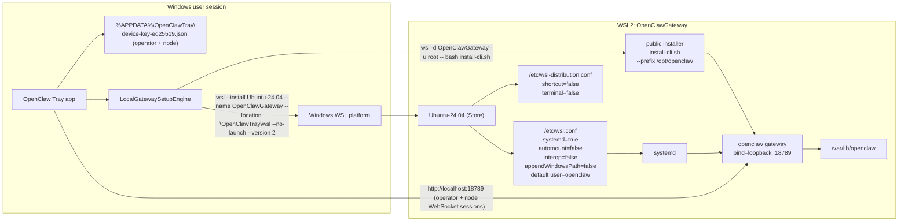

# OpenClaw Windows local gateway: WSL design validation

This document describes the WSL design that ships in this PR. It reflects Craig
Loewen's authoritative review of `docs/wsl-owner-open-issues.md` (verbatim Q&A
reproduced inline in that companion doc). Where the prototype enumerated
options, this version states the chosen design.

The current scope is:

- A dedicated app-owned **Ubuntu-24.04** WSL2 instance named `OpenClawGateway`,
  created from the standard Ubuntu Store package and then configured by the
  Windows tray.
- The public OpenClaw Linux installer (`https://openclaw.ai/install-cli.sh`)
  runs unchanged inside that instance with prefix `/opt/openclaw`.
- **Loopback-only** local networking (`http://localhost:18789`) between the
  Windows tray and the gateway.
- Repair / restart via instance-scoped `wsl --terminate OpenClawGateway`.
- Diagnostics on failure pointed at <https://aka.ms/wsllogs>.
- The Windows tray pairs as both **operator** and **node** against the local
  gateway (matching the macOS app's in-app node model). No worker-in-WSL is
  installed by the Windows tray in this PR.

Out of scope for this PR (explicitly):

- No custom OpenClaw rootfs / OpenClaw-distributed Linux image.
- No `--web-download` / `--from-file` / signed offline-base-artifact fallback.
- No WSL-IP / `lan` / `auto`-bind fallback. No `gateway.bind` overrides.
- No global `.wslconfig` mutation. No global `wsl --shutdown` from any product
  or validation path.
- No `\\wsl$` or `\\wsl.localhost` file I/O. All WSL file operations go through
  `wsl.exe -d OpenClawGateway -- ...`.

## High-level user experience

1. User installs or opens the Windows tray app.
2. The first onboarding page (`SetupWarningPage`) offers **Set up locally**
   (default) or **Advanced setup**.
3. **Set up locally** opens `LocalSetupProgressPage`, which drives
   `LocalGatewaySetupEngine` to:
   - preflight the WSL host;
   - create the `OpenClawGateway` instance from Ubuntu-24.04;
   - apply OpenClaw-owned WSL configuration (`/etc/wsl.conf`,
     `/etc/wsl-distribution.conf`, `openclaw` user, state directories);
   - install OpenClaw via the public installer;
   - prepare and start the gateway service;
   - mint a bootstrap setup-code via `openclaw qr --json`;
   - pair the Windows tray operator and Windows tray node;
   - verify end-to-end reachability over loopback.
4. On terminal failure, the page surfaces a link to <https://aka.ms/wsllogs>;
   no internal log scraping is attempted.

## End-state architecture



## WSL touch points

### Dedicated WSL instance lifecycle

The tray treats WSL as an application-owned runtime boundary and uses a single
dedicated WSL2 instance named `OpenClawGateway`. The base is **Ubuntu-24.04**
from the Store; the OpenClaw-owned configuration is applied after the instance
is laid down.

| Operation | WSL command | Scope |
| --- | --- | --- |
| Preflight | `wsl.exe --status`, `wsl.exe --list --verbose` | Read-only WSL capability checks |
| Instance creation | `wsl.exe --install Ubuntu-24.04 --name OpenClawGateway --location <%LOCALAPPDATA%>\OpenClawTray\wsl --no-launch --version 2` | Creates only the dedicated OpenClaw instance |
| In-instance configuration | `wsl.exe -d OpenClawGateway -u root -- ...` | Writes `/etc/wsl.conf`, `/etc/wsl-distribution.conf`, creates `openclaw` user and state dirs |
| Default user | `wsl.exe --manage OpenClawGateway --set-default-user openclaw` | Locks default user to `openclaw` |
| Apply config | `wsl.exe --terminate OpenClawGateway` (then implicit restart on next command) | Picks up `wsl.conf` changes |
| Public OpenClaw install | `wsl.exe -d OpenClawGateway -u root -- bash -c "curl -fsSL https://openclaw.ai/install-cli.sh \| bash -s -- --prefix /opt/openclaw"` | Runs the public installer unchanged |
| Service start/check | `wsl.exe -d OpenClawGateway -u root -- systemctl ...` | Starts/checks OpenClaw gateway |
| Repair | `wsl.exe --terminate OpenClawGateway` | Instance-scoped restart only |
| Remove | `wsl.exe --terminate OpenClawGateway`, `wsl.exe --unregister OpenClawGateway` | Requires explicit user confirmation |

Guarantees:

- **WSL2 only** for the OpenClaw instance.
- The tray never modifies the user's default WSL instance.
- The tray never modifies global `.wslconfig`.
- The tray never calls global `wsl.exe --shutdown` in any product, validation,
  repair, or removal path.
- The tray never unregisters arbitrary WSL instances; only the exact
  `OpenClawGateway` name is eligible, and destructive cleanup requires explicit
  confirmation in scripts.

### Install command and success criterion

The single canonical install primitive is:

```powershell
wsl.exe --install Ubuntu-24.04 `
        --name OpenClawGateway `
        --location "$env:LOCALAPPDATA\OpenClawTray\wsl" `
        --no-launch `
        --version 2
```

Success criterion (per Craig): **trust the `wsl --install` exit code**.
There is no postcondition-on-hang fallback. After exit, the engine confirms
that `OpenClawGateway` appears in `wsl --list --quiet`; failure of that
post-condition is treated as install failure regardless of stdout.

`Ubuntu-24.04` is used explicitly (not the generic `Ubuntu` channel). No
`--web-download` and no `--from-file` are used; there is no offline base
fallback in this PR.

#### Empirical evidence

The literature recommendation (`wsl --install` over `winget install
Canonical.Ubuntu.2404`) was confirmed empirically on 2026-05-04 with a 20-iter
harness:

| Path | success | failure | strict success rate |
|---|---:|---:|---|
| `wsl --install Ubuntu-24.04 --name <gen> --location <path> --no-launch --version 2` | 10 | 0 | **10/10** |
| `winget install --id Canonical.Ubuntu.2404 -e --silent --accept-source-agreements --accept-package-agreements --disable-interactivity` | 0 | 10 | **0/10** |

Success ≡ exit 0 AND target distro registered in `wsl --list --quiet`.

Root cause for winget 0/10: `Canonical.Ubuntu.2404` is the launcher APPX, not
a WSL distro creator; with `--silent --disable-interactivity` the launcher is
never invoked, so the APPX stages but no distro registers. winget cannot pass
`--name` or `--location` to the launcher.

Harness, raw timings, exit codes, and per-iteration `detail.json`:
`artifacts/wsl-install-vs-winget/run-20260504-131837/summary.json`. (The
`artifacts/` tree is gitignored; the summary will be present on any host that
runs `scripts/experiments/wsl-install-vs-winget-empirical-2026-05-04.ps1`.)

A deeper winget research thread is in flight (Aaron-9, prototype worktree).
That work may broaden the picture for `winget install Microsoft.WSL` as a
**platform** repair fallback — it does not change the Phase 3 decision to use
`wsl --install` for distro creation in this PR.

### `/etc/wsl.conf`

```ini
[boot]
systemd=true

[automount]
enabled=false
mountFsTab=false

[interop]
enabled=false
appendWindowsPath=false

[user]
default=openclaw

[time]
useWindowsTimezone=true
```

Rationale (Craig confirmed all settings appropriate for an app-owned
appliance):

- `systemd=true` — gateway is a systemd-managed service.
- `automount.enabled=false` / `mountFsTab=false` — the gateway does not need
  Windows drive mounts.
- `interop.enabled=false` / `appendWindowsPath=false` — the appliance does not
  shell out to Windows binaries.
- `default=openclaw` — non-root default user; root only via explicit
  `wsl.exe -d OpenClawGateway -u root -- ...`.
- `useWindowsTimezone=true` — gateway timestamps align with the user's
  Windows session.

Per Craig: no post-clone repairs needed (machine-id / DNS / timezone work as
delivered by Ubuntu-24.04).

### `/etc/wsl-distribution.conf`

```ini
[oobe]
defaultName=OpenClawGateway

[shortcut]
enabled=false

[terminal]
enabled=false
```

Rationale: the OpenClaw instance is an implementation detail; users should not
see a Start menu shortcut or Windows Terminal profile for it. Craig confirmed
this is the correct use of `wsl-distribution.conf` for a privately managed
instance.

### Networking — loopback only

The gateway binds to **loopback inside WSL on port 18789**. The Windows tray
connects via `http://localhost:18789` / `ws://localhost:18789`.

Per Craig: Windows localhost forwarding to a WSL2 service is a reliable core
WSL promise. **No** WSL-IP fallback. **No** `lan` or `auto` bind. **No**
`gateway.bind` overrides written by the tray. **No** Windows portproxy or
firewall mutation.

The endpoint resolver and validation runner do not enumerate WSL interface
addresses, do not run `hostname -I` / `ip -4 addr` / `ip route` / `ss -ltnp`
inside WSL, and do not promote between bind modes. There is one Windows-side
TCP listener snapshot of port 18789 plus a loopback `/health` probe.

Off-box / LAN / phone reachability is out of scope for this PR and will be
handled separately when relay ownership and protocol are clear.

### Lifecycle and service ownership

- The gateway is started/managed via upstream OpenClaw CLI commands invoked
  through `wsl.exe -d OpenClawGateway -u root -- ...`.
- `loginctl enable-linger openclaw` plus a tray-owned WSL keepalive
  (`wsl.exe -d OpenClawGateway -u openclaw -- sleep 2147483647`) keep the
  instance reachable while local-gateway mode is active. Both patterns are
  acceptable per Craig.
- Repair primitive: `wsl.exe --terminate OpenClawGateway`. Global
  `wsl --shutdown` is **never** issued.
- Removal: `wsl.exe --unregister OpenClawGateway` only (after explicit user
  confirmation), preceded by `wsl.exe --terminate OpenClawGateway`. Cleanup
  also removes the install-location directory.

Product readiness for the gateway requires all of:

1. service start/restart command returns;
2. WSL listener exists on `:18789`;
3. Windows-side `http://localhost:18789/health` probe succeeds;
4. gateway status / RPC succeeds with the device token;
5. setup-code mint succeeds.

`systemctl active` alone is not treated as readiness.

### Diagnostics

On any setup failure, the engine and validation script surface the link
<https://aka.ms/wsllogs> for the user/maintainer to collect WSL logs. The
product does **not** scrape WSL internal log files or invoke
`wsl --shutdown` to collect them. The validation script's
`Save-DiagnosticsSnapshot` records `wslLogsHelp = https://aka.ms/wsllogs` and
`Write-Summary` appends a "Diagnostics: see https://aka.ms/wsllogs..." note
to `summary.md` on failure.

### Host filesystem and file I/O

All WSL file operations from Windows go through `wsl.exe -d OpenClawGateway
-- ...` subprocess calls. `\\wsl$` and `\\wsl.localhost` are forbidden in
product code, validation scripts, tests, and ad-hoc PowerShell. The instance
does not depend on any Windows drive mount after setup.

### Pairing and protocol boundary

OpenClaw pairing is implemented entirely through the upstream OpenClaw
protocol. The tray never edits gateway pairing stores directly.

1. Gateway starts with local token auth from
   `/var/lib/openclaw/gateway.env`.
2. Tray invokes `wsl.exe -d OpenClawGateway -- openclaw qr --json` and
   decodes the upstream setup-code payload (with short-lived bootstrap
   token).
3. Tray (operator) connects over WebSocket using its Ed25519 device identity
   and `auth.bootstrapToken`; gateway returns `hello-ok.auth.deviceToken`,
   stored in `%APPDATA%\OpenClawTray\device-key-ed25519.json` (operator
   token field).
4. Tray (node) opens a separate WebSocket session with role `node` and
   pairs through the same setup-code/bootstrap-token flow; the resulting
   device token is stored in the same identity file under the **node**
   field.
5. Subsequent reconnects use `auth.deviceToken`. Node tokens are never
   reused as `auth.token` and vice versa.

Identity-path invariant: operator and node device tokens share
`%APPDATA%\OpenClawTray\device-key-ed25519.json` (`OPENCLAW_TRAY_APPDATA_DIR`
override honored), with role distinction inside the file. The
prototype-era split between `%APPDATA%` (operator) and `%LOCALAPPDATA%`
(node) was closed in Phase 4.

The Windows tray node parallels the macOS app's in-app node model
(`MacNodeModeCoordinator` with role `node`, separate session, capabilities
declared). No WSL-internal worker is paired by the Windows tray in this PR.

## Validation

`scripts/validate-wsl-gateway.ps1` provides four scenarios. Each writes a
JSON+markdown summary under `artifacts/validate-wsl-gateway/<run-id>/`.

Validation AppData isolation uses this canonical contract:

- `OPENCLAW_TRAY_DATA_DIR` is the settings/logs/run-marker root consumed by
  `SettingsManager`, `App.DataPath`, `Logger`, and token path resolution.
- `OPENCLAW_TRAY_APPDATA_DIR` is the roaming identity-store root consumed by
  `DeviceIdentity`/pairing paths. Validation sets it alongside
  `OPENCLAW_TRAY_DATA_DIR` for backward compatibility and identity isolation.
- `OPENCLAW_TRAY_LOCALAPPDATA_DIR` is the local setup-state/WSL-install root.

| Scenario | What it does | When to use | Destructive |
|---|---|---|---|
| `PreflightOnly` | Repo-layout sanity, WSL host status (`wsl --status`, `wsl --list --verbose`), relay-prototype probe (NotAvailable when no probe URI). No build, no install, no WSL state mutation. | Cheap CI / local sanity check. Safe on dev box. | No |
| `UpstreamInstall` | Build + tests, then drives the tray onboarding so the product itself runs the canonical `wsl --install Ubuntu-24.04 --name OpenClawGateway --location <path> --no-launch --version 2` path. Smoke + bootstrap-token + operator+node pairing proofs over loopback. Reuses an existing `OpenClawGateway` instance if present. | Lab / dedicated machine. End-to-end product path. | Reuses existing distro state |
| `FreshMachine` | `UpstreamInstall` after a fresh-machine reset: `wsl --unregister OpenClawGateway` + AppData wipe (single shot). | Lab. Fresh install proof. | Yes, scoped to `OpenClawGateway` |
| `Recreate` | Iterated `FreshMachine`. Supports `-Iterations`. Uses `wsl --unregister` only — **never** `wsl --shutdown`. | Lab / repeatability harness. | Yes, scoped to `OpenClawGateway` |

Scenarios deliberately removed from the prototype: `BuildRootfs`,
`InstallOnly`, `Smoke`, `Full`, `Loop`. Parameters deliberately removed:
`-BuildDevRootfs`, `-BaseRootfsPath`, `-GatewayPackagePath`,
`-UseExistingManifest`, `-RootfsPath`, `-AllowUnsignedDevArtifact`,
`-SigningKeyId`, `-PublicKeyPath`,
`-AllowNonStandardDistroNameForDestructiveClean`, `-NetworkingMode`,
`-LoopMode`, `-RequireWorkerPairing`, `-CleanOpenClawState`,
`-GoSkillProofCommand`, `-RequireGoSkillProof`.

The validation script:

- Drives onboarding via the `SetupWarningPage` "Set up locally" button
  (`OnboardingSetupLocal` automation ID); `LocalSetupProgressPage` autostarts
  the engine on appearance.
- Polls `setup-state.json` for `Complete` (terminal status). Worker / rootfs
  phases are gone; terminal status is `Complete` only.
- Snapshots loopback diagnostics on failure (Windows-side `:18789` listener
  state; loopback `/health` probe). Does **not** run any networking probes
  inside WSL.
- Redacts sensitive output: `Redact-SensitiveGatewayOutput` over
  `openclaw qr --json` stdout, `Save-RedactedSettings` strips `Token`,
  `GatewayToken`, `BootstrapToken`, `bootstrap_token`, `NodeToken`,
  `nodeToken`; relay probe body strips `token=...`.

Scope guarantees from the validation script:

- Only `OpenClawGateway` is ever the target of `wsl --unregister`.
- Global `wsl --shutdown` is never issued.
- No `\\wsl$` or `\\wsl.localhost` paths are read or written.

Companion script:
`scripts/reset-openclaw-wsl-validation-state.ps1` — exact-target gated
cleanup for `OpenClawGateway` plus the `%APPDATA%\OpenClawTray` and
`%LOCALAPPDATA%\OpenClawTray` directories. Refuses to act on any other distro
name.

## Outstanding follow-ups

Tracked but outside the scope of this PR:

- Off-box / LAN / phone reachability via OpenClaw relay (blocked on relay
  ownership / protocol clarity).
- Optional `winget install Microsoft.WSL` as a **platform** repair fallback
  (deeper research in flight). Distro creation stays on `wsl --install`
  regardless.
- Internationalization of the onboarding copy (`Onboarding_SetupWarning_*`
  / `Onboarding_LocalSetupProgress_*` resw entries across the supported
  locales).

See `docs/wsl-owner-open-issues.md` for the structured Q&A explaining **why**
this design is what it is, with Craig's verbatim answers.
